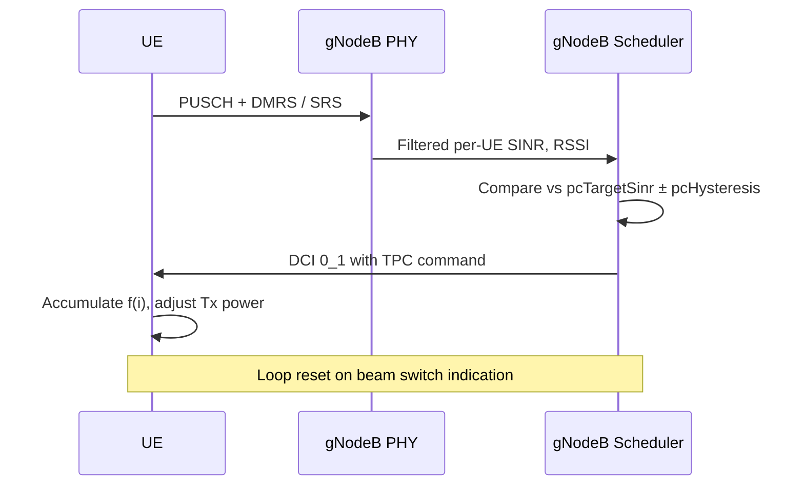

This section details the operational procedure for closed-loop power control in FR2 serving cells, including uplink SINR estimation, TPC command evaluation, and blockage recovery mechanisms.

## Closed-Loop Power Control Mechanism

For each RRC-connected UE with an active FR2 serving cell, the scheduler maintains a per-carrier closed-loop state $f(i)$ as defined in TS 38.213 clause 7.1. 

### Uplink SINR Estimation & TPC Command Generation

1. **Measurement**: Every scheduling occasion, the uplink SINR estimator produces a filtered per-UE SINR based on PUSCH DMRS and periodic SRS.
2. **Comparison**: The controller compares the measured value against `pcTargetSinr` with a hysteresis window of `pcHysteresis` dB.
3. **Adjustment**:
   - If the measured value is outside the window, a TPC command of $\pm 1\text{ dB}$ (or $+3\text{ dB}$ for fast ramp-up after blockage recovery) is embedded in the next uplink DCI (e.g., DCI 0_1).
   - Commands accumulate at the UE, moving its operating point.
   - The loop resets upon a beam switch indication.

### Blockage Recovery

A blockage-recovery mechanism detects a sudden SINR drop of more than `blockageDetectThr` dB and temporarily authorizes $+3\text{ dB}$ steps until the target window is re-entered, shortening recovery from hand or body blockage from seconds to a few hundred milliseconds.

### Sequence Flow

# Cross-References

- Configuration parameters used in this operational flow are listed in [Parameters](parameters.md).
