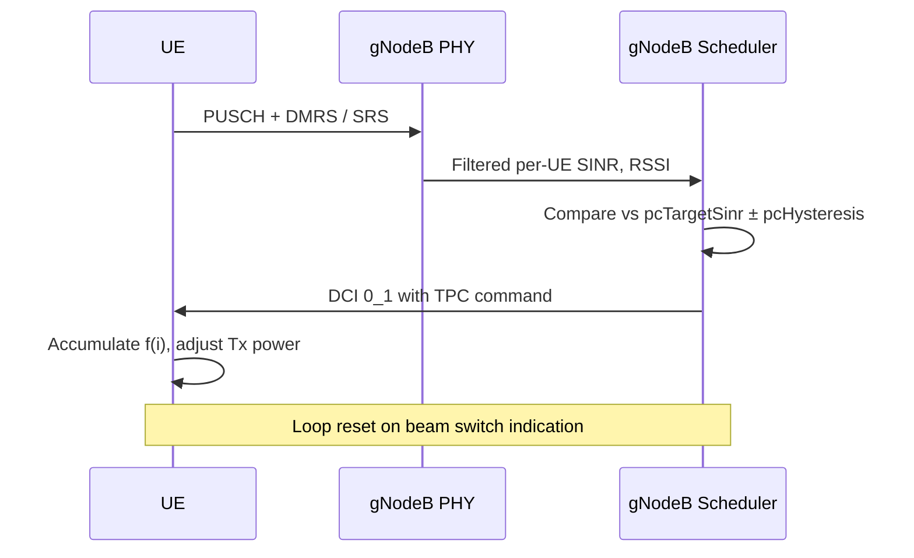

This section describes the operation of closed-loop power control and the blockage recovery mechanism for Frequency Range 2 (FR2) serving cells.

## Closed-Loop Power Control Operation

For each RRC-connected UE with an active FR2 serving cell, the scheduler maintains a per-carrier closed-loop state $f(i)$ as defined in TS 38.213 clause 7.1.

On every scheduling occasion, the uplink SINR estimator produces a filtered per-UE SINR based on PUSCH DMRS and periodic SRS. The controller compares this measured SINR against `pcTargetSinr` with a hysteresis window of `pcHysteresis` dB:
- If the measured value is outside the window, a Transmit Power Control (TPC) command of $\pm 1\text{ dB}$ (or $+3\text{ dB}$ for fast ramp-up after blockage recovery) is embedded in the next uplink DCI.
- Commands accumulate at the UE, moving its operating point.
- The loop is reset on a beam switch indication.

```mermaid
sequenceDiagram 
    participant UE 
    participant PHY as gNodeB PHY 
    participant SCH as gNodeB Scheduler 
    UE->>PHY: PUSCH + DMRS / SRS 
    PHY->>SCH: Filtered per-UE SINR, RSSI 
    SCH->>SCH: Compare vs pcTargetSinr ± pcHysteresis 
    SCH->>UE: DCI 0_1 with TPC command 
    UE->>UE: Accumulate f(i), adjust Tx power 
    Note over UE,SCH: Loop reset on beam switch indication
```

## Blockage Recovery Mechanism

A blockage-recovery mechanism detects a sudden SINR drop of more than `blockageDetectThr` dB and temporarily authorizes $+3\text{ dB}$ steps until the target window is re-entered. This shortens recovery from hand or body blockage from seconds to a few hundred milliseconds.

# Cross-References

- [PARAMETERS](parameters.md) — Parameter definitions associated with closed-loop power control and blockage recovery.
