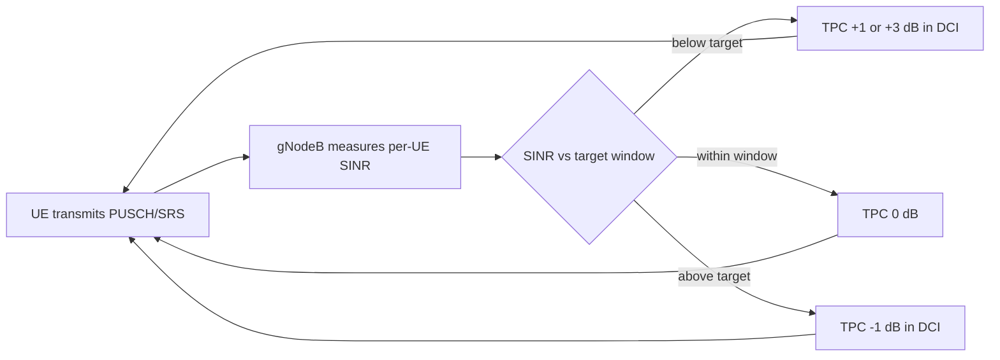

This section provides an overview of the Closed-Loop Power Control High-Band feature for NR high-band (FR2, mmWave) carriers operating as PCells or SCells.

## Feature Overview

Closed-Loop Power Control High-Band introduces network-controlled, closed-loop adjustment of UE uplink transmit power on NR high-band (FR2, mmWave) carriers operating as PCells or SCells in a carrier aggregation configuration.

### Comparison with Open-Loop Control

Without this feature, high-band uplink power is governed purely by open-loop power control:
* The UE estimates its pathloss from SSB or CSI-RS measurements.
* The UE derives its PUSCH, PUCCH, and SRS transmit power from the broadcast `p0` and `alpha` values as specified in TS 38.213.

Open-loop control is adequate when the pathloss estimate is accurate, but on FR2 carriers the estimate is inherently noisy due to:
* Beamformed links changing gain abruptly when the UE or gNodeB switches beams.
* Blockage events causing step changes of 15–25 dB.
* UE power-class limitations interacting with beam-specific EIRP limits.

### Closed-Loop Control Mechanism

This feature closes the loop through network measurements and dynamic commands:
1. The gNodeB continuously measures the received SINR and the per-UE received power on PUSCH and SRS.
2. The gNodeB compares these measurements against a configurable target.
3. The gNodeB issues Transmit Power Control (TPC) commands in DCI formats `0_1`/`0_2` (accumulated or absolute mode).

As a result, each UE converges on the minimum transmit power that satisfies the receive target.

### Key Benefits & Gains

* **Interference Reduction:** Reduces inter-cell and inter-beam interference. In carrier aggregation deployments, uncontrolled uplink power on one carrier raises the noise floor for all co-scheduled UEs on adjacent beams.
* **Link Adaptation & Battery Life:** Improves uplink link adaptation accuracy and extends UE battery life.
* **Measured Performance Gains:**
  * **1.5–3 dB reduction** in average uplink interference-over-thermal (IoT) on loaded FR2 cells.
  * **10–20% improvement** in uplink cell-edge throughput, as cell-edge UEs no longer compete against over-powered cell-center UEs.

# Cross-References

* [Feature Operation](feature-operation.md)
* [Network Impact](network-impact.md)
* [Parameters](parameters.md)
