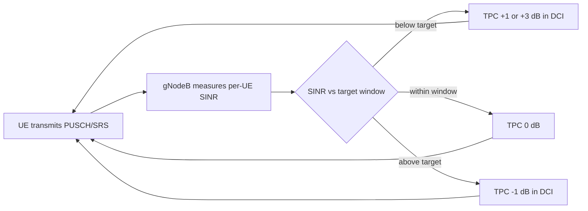

This section provides a high-level overview of the Closed-Loop Power Control High-Band feature for NR high-band (FR2) deployments, comparing open-loop and closed-loop operation and detailing observed performance gains.

## Feature Overview

Closed-Loop Power Control High-Band introduces network-controlled, closed-loop adjustment of UE uplink transmit power on NR high-band (FR2, mmWave) carriers operating as PCells or SCells in a carrier aggregation configuration.

### Open-Loop vs. Closed-Loop Power Control

Without this feature, high-band uplink power is governed purely by open-loop power control:
- The UE estimates its pathloss from SSB or CSI-RS measurements.
- The UE derives its PUSCH, PUCCH, and SRS transmit power from the broadcast `p0` and `alpha` values as specified in TS 38.213.

While open-loop control is adequate when pathloss estimates are accurate, pathloss estimates on FR2 carriers are inherently noisy due to:
- Abrupt gain changes in beamformed links when the UE or gNodeB switches beams.
- Blockage events causing step changes of 15–25 dB.
- Interactions between UE power-class limitations and beam-specific EIRP limits.

This feature closes the loop through active gNodeB monitoring and feedback:
1. The gNodeB continuously measures the received SINR and per-UE received power on PUSCH and SRS.
2. The measurements are compared against a configurable target.
3. The gNodeB issues Transmit Power Control (TPC) commands in DCI formats 0_1/0_2 using accumulated or absolute mode.

### Operational Benefits

- **Power Optimization:** Each UE converges on the minimum transmit power that satisfies the receive target.
- **Interference Reduction:** Reduces inter-cell and inter-beam interference.
- **Link Adaptation & Battery Life:** Improves uplink link adaptation accuracy and extends UE battery life.
- **Carrier Aggregation Advantage:** In carrier aggregation deployments where multiple UEs aggregate high-band SCells, uncontrolled uplink power on one carrier raises the noise floor for all co-scheduled UEs on adjacent beams; closed-loop control prevents this noise floor elevation.

### Measured Performance Gains

- **Uplink Interference-over-Thermal (IoT):** Typical measured gains show a 1.5–3 dB reduction in average uplink IoT on loaded FR2 cells.
- **Cell-Edge Throughput:** A 10–20% improvement in uplink cell-edge throughput, as cell-edge UEs no longer compete against over-powered cell-center UEs.

### Control Loop Flow

# Cross-References

- [Feature Operation](feature-operation.md)
