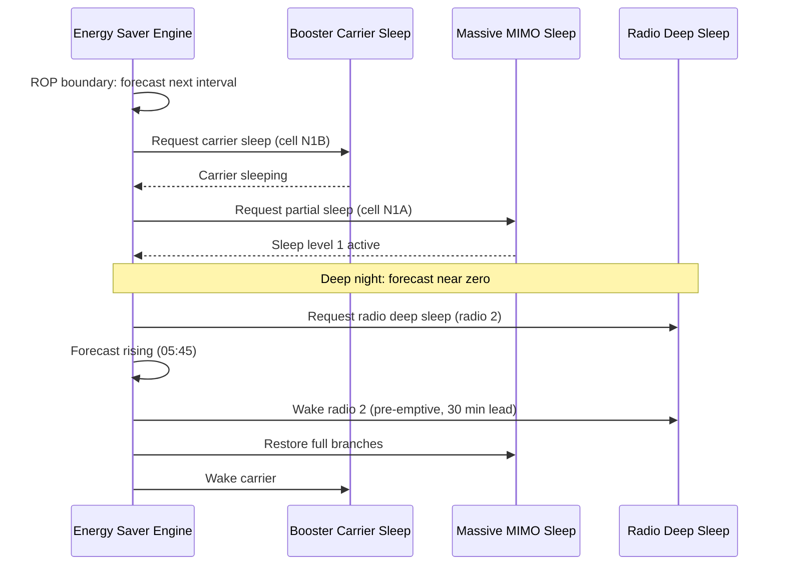

This section describes the operational logic and sequence of the Automated Energy Saver (AES) decision engine, including load forecasting, energy state mapping policies, subordinate feature sequencing, and pre-emptive wake-up mechanisms.

## Operational Logic

### Decision Engine Execution and Load Forecasting
The decision engine runs every 15 minutes, aligned to the Result Output Period (ROP) boundary. For each cell, it generates a load forecast for the upcoming interval, expressed in terms of:
- Expected Physical Resource Block (PRB) utilization
- Expected RRC-connected users

### Target Energy State Mapping (`savingsLevel`)
The forecast is mapped to a target energy state according to the operator's configured `savingsLevel` policy:
- **CONSERVATIVE**: Requires the forecast plus a 3-sigma margin to stay below the subordinate feature's entry threshold.
- **BALANCED**: Uses a 2-sigma margin.
- **AGGRESSIVE**: Uses a 1-sigma margin.

### Subordinate Feature Request Order
The decision engine issues state requests to subordinate features in a fixed sequence:
- **Sleep Sequence**: Booster carriers first, Massive MIMO branch sleep second, radio deep sleep last.
- **Wake-up Sequence**: Issued in the reverse order (radio deep sleep first, Massive MIMO branches second, booster carriers last), restoring capacity bottom-up before it is needed.

### Pre-emptive Wake-up Control (`wakeupLeadTime`)
Wake-ups are issued pre-emptively using a configurable lead time (`wakeupLeadTime`) ahead of the forecast load rise. This removes the reactive wake-up latency of subordinate features from the user experience during the morning ramp.

## Feature Operation Sequence Diagram

# Cross-References

- [PARAMETERS](parameters.md)
- [FEATURE DEPEDENCIES](feature-depedencies.md)
