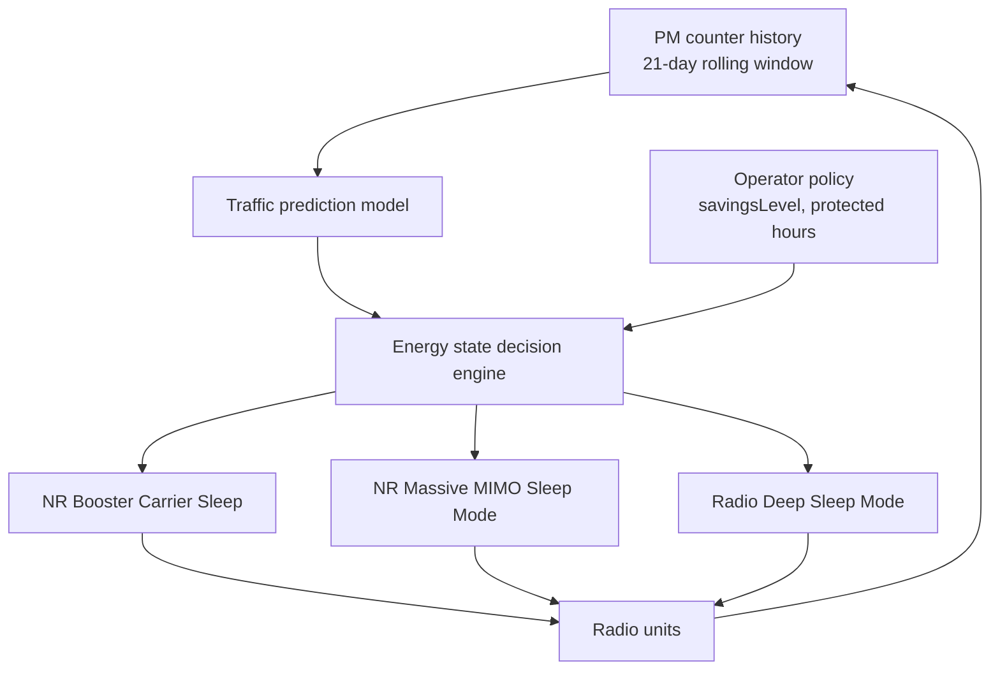

This section provides a high-level overview of the Automated Energy Saver feature, which serves as a node-level orchestration layer for individual energy-saving functions within the gNodeB.

## Overview and Problem Statement

Automated Energy Saver provides node-level orchestration for gNodeB energy-saving functions. Instead of requiring manual tuning of thresholds and time windows for each cell, the feature builds a per-cell traffic prediction model to arm, tune, and sequence underlying energy savers without operator intervention. The coordinated features include:

- NR Booster Carrier Sleep
- NR Massive MIMO Sleep Mode
- Radio Deep Sleep Mode
- NR Micro Sleep Tx

The primary issue addressed is feature coordination. Individual energy features operate safely in isolation, but their thresholds interact:
- A booster carrier sleeping too early shifts traffic load to the coverage carrier, preventing it from reaching its sleep-entry threshold.
- Partial sleep in a Massive MIMO cell alters PRB utilization figures relied upon by radio deep-sleep decisions.

## Decision Mechanism and Hierarchy

Automated Energy Saver manages the decision hierarchy by:
1. Learning cell diurnal load patterns from PM counter history using a 21-day rolling window with separate weekday and weekend profiles.
2. Forecasting load for the upcoming decision interval.
3. Computing target energy states per cell and per radio.

Individual features execute state transitions through standard mechanisms, preserving built-in safeguards such as emergency-call blocking and wake-up guarantees.

## Operator Policy and Performance

Operators maintain control via a concise set of parameters:
- `savingsLevel`: Overall savings ambition level.
- Protected hours: Time windows during which automated actions are suspended.
- Per-cell opt-out: Ability to exclude specific cells from automation.

In field deployments, automated coordination typically achieves an additional 5–15% site energy saving compared to statically configured features, primarily by extending sleep windows into shoulder hours left unaddressed by static time-of-day settings.

# Cross-References

- [Parameters](parameters.md)
- [Feature Operation](feature-operation.md)
