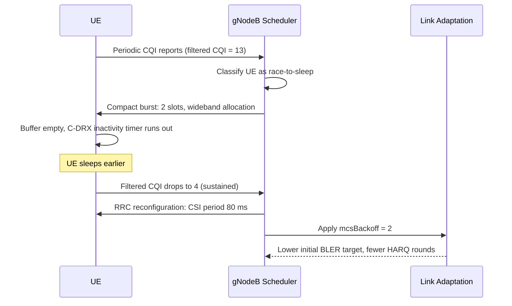

This section details the operational logic of the CQI-Based UE Energy Efficiency Enhancement feature, including CQI filtering, UE classification into race-to-sleep or relaxed classes, dynamic scheduling, link adaptation adjustments, and class transition hysteresis.

## Operational Logic

### CQI Filtering
Per connected UE, the feature maintains a smoothed wideband CQI estimate using an exponential filter over reported CQI values with time constant `cqiFilterTime`.

### UE Classification and Action

- **Race-to-Sleep Class**:
  - **Condition**: Filtered CQI is at or above `highCqiThr`.
  - **Behavior**: The scheduler aggregates pending downlink data into the smallest number of slots permitted by buffer and PRB availability, prioritizing wideband allocations. When the buffer empties, the scheduler immediately releases the UE toward C-DRX inactivity.

- **Relaxed Class**:
  - **Condition**: Filtered CQI stays at or below `lowCqiThr` for `lowCqiHoldTimer` seconds.
  - **Behavior**: The UE's periodic CSI report interval is reconfigured from the cell default to `relaxedCsiPeriod`. Downlink link adaptation applies a fixed back-off of `mcsBackoff` MCS indices to cut HARQ retransmission probability roughly in half.

### Class Transition Hysteresis
Class transitions include hysteresis (`cqiClassHysteresis1234234554`) so that UEs on the class boundary do not oscillate between configurations, which would itself cost RRC signaling and UE energy.

## Interaction Sequence

# Cross-References

- [Parameters](parameters.md)
