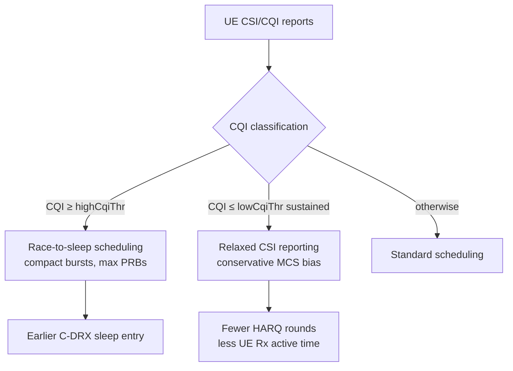

This section provides an overview of the CQI-Based UE Energy Efficiency Enhancement feature, detailing its scheduling compaction and CSI relaxation mechanisms, operational workflow, and impact on UE power saving and network utilization.

## Overview and Key Principles

CQI-Based UE Energy Efficiency Enhancement reduces the battery consumption of connected-mode UEs by adapting scheduling and link-adaptation behavior to the radio conditions each UE reports through its Channel Quality Indicator (CQI). 

A UE's modem energy per delivered bit varies strongly with channel quality:
- A UE at high CQI can drain its buffer in a few slots and return to Connected-Mode DRX (C-DRX) sleep quickly.
- A UE at low CQI spends many more slots awake receiving low-rate transmissions and HARQ retransmissions for the same payload.

## Feature Mechanisms

The feature acts on UE channel quality reports through two distinct mechanisms:

1. **CQI-Conditioned Scheduling Compaction ("Race to Sleep")**
   - Applied when UEs report CQI above a configurable threshold (`highCqiThr`).
   - The scheduler prefers fewer, larger allocations (more Physical Resource Blocks [PRBs], higher aggregation of pending data into one transmission burst).
   - Minimizes the UE's active time—and consequently its RF and baseband wake time—following the classical "race to sleep" strategy described in 3GPP TR 38.840.

2. **Low-CQI Optimization**
   - Applied when UEs persistently report low CQI (at or below `lowCqiThr`).
   - Relaxes the CQI reporting configuration itself by setting longer periodic CSI reporting intervals per 3GPP TS 38.331 `CSI-ReportConfig`.
   - Biases link adaptation toward a slightly more conservative Modulation and Coding Scheme (MCS), reducing HARQ retransmission rounds that keep the UE receiver active.

Both mechanisms operate standard RRC reconfigurations and remain fully transparent to the UE without requiring UE-vendor-specific behavior.

## Operational Workflow

## Performance Impact and Complementary Features

- **Network Side**: Modest effect; scheduling compaction slightly increases instantaneous PRB utilization while reducing the number of scheduled slots per UE.
- **UE Side**: Field measurements demonstrate a 5–12% reduction in connected-mode modem energy for smartphone traffic mixes, achieving the highest gains for bursty applications on cells with a healthy CQI distribution.
- **Complementary Functionality**: The feature complements Connected Mode DRX (C-DRX) and NR Service-Adaptive DRX, which control the sleep opportunity itself, by shortening the awake time needed per data burst.

# Cross-References

- [Feature Operation](feature-operation.md)
- [Network Impact](network-impact.md)
