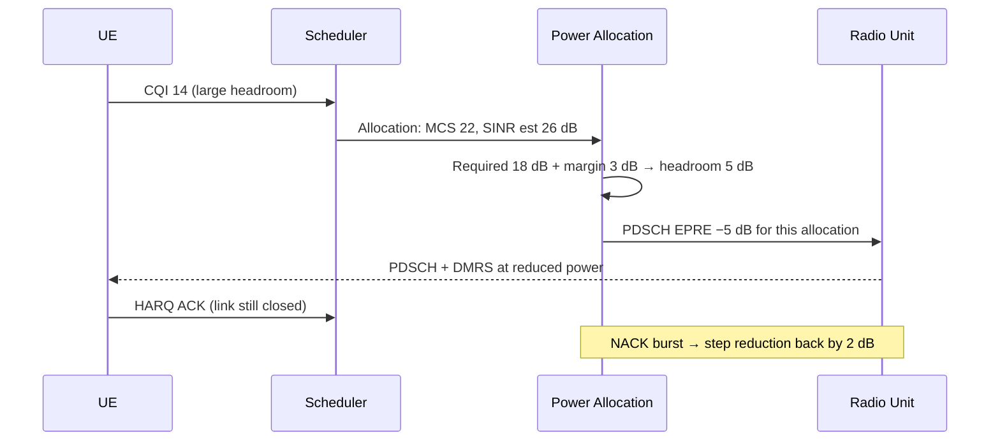

This section details the operational workflow, power reduction formula, implicit signaling mechanism, and guard functionality for Energy-Optimized Power Allocation.

## Headroom Calculation and Power Reduction

At every scheduling occasion, the scheduler passes the candidate UE, its selected Modulation and Coding Scheme (MCS), and its filtered SINR estimate to the power allocation function.

The function calculates available power headroom as follows:

$$\text{headroom} = \text{estimated SINR} - \text{required SINR(MCS)} - \text{powerMargin}$$

If the calculated headroom is positive:
* PDSCH EPRE for the allocation is reduced by $\min(\lfloor\text{headroom}\rfloor, \text{maxPowerReduction})$ dB.
* The reduction is quantized to **1 dB** steps.

## Implicit Signaling and Outer-Loop Adaptation

The applied power offset is signaled implicitly. Because 3GPP NR UEs derive PDSCH demodulation from Demodulation Reference Signals (DMRS) embedded in the same allocation (per 3GPP TS 38.214), no explicit signaling is required, and the UE demodulates correctly at the reduced power level.

The outer-loop link adaptation monitors HARQ feedback at the reduced power level and adjusts the SINR estimate accordingly, closing the feedback loop.

## Sequence Diagram

## Aggregate Reporting and Guard Mechanism

* **PA Bias Optimization:** The per-cell aggregate power reduction is reported to the radio unit, which utilizes this data for Power Amplifier (PA) bias optimization where supported.
* **Retransmission Guard:** A guard mechanism suspends all power reductions for a UE for a duration defined by `guardTime` after two consecutive NACKs, ensuring retransmission robustness.

# Cross-References

* [Parameters](parameters.md) - Documents configuration parameters including `powerMargin`, `maxPowerReduction`, and `guardTime`.
