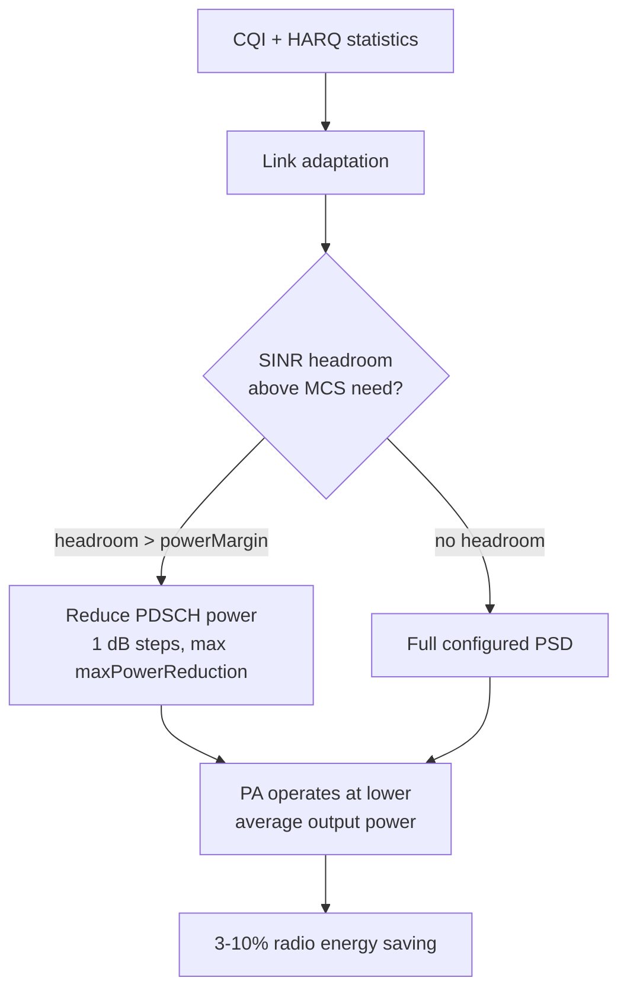

This section provides an overview of the Energy-Optimized Power Allocation feature, describing its mechanism for reducing radio unit energy consumption through dynamic, per-allocation PDSCH transmit power adjustments.

## Overview and Key Principles

Energy-Optimized Power Allocation reduces radio unit energy consumption by dynamically adapting the downlink transmit power allocated to PDSCH resources according to the actual link budget needs of the scheduled UEs, instead of transmitting every allocation at the full configured power spectral density (PSD).

In a conventional configuration, a cell's maximum output power is spread uniformly over allocated PRBs regardless of user location:
- A UE 50 meters from the site receives the same power spectral density as a cell-edge UE.
- Power amplifier (PA) output and energy are wasted on links that already have tens of dB of SINR margin.

The feature addresses this inefficiency through a per-allocation power decision:
- For each scheduled UE, the link adaptation function computes the SINR headroom above what the selected MCS requires, derived from CQI reports and HARQ statistics.
- When headroom exceeds a configurable margin (`powerMargin`), the PDSCH power for that allocation is reduced in 1 dB steps, up to a maximum reduction of `maxPowerReduction` dB.
- Saved power is genuinely removed from the PA operating point to lower DC power draw, rather than being redistributed to other users.
- On radios that support fast PA bias adaptation, average PA efficiency improves further because the PA tracks a lower average output power.

### Channel Exclusions

Common channels are explicitly excluded from power reduction:
- **Excluded signals/channels**: SSB, CSI-RS, PDCCH, and all broadcast signals are never power-reduced.
- **Impact**: Cell coverage, mobility measurements, and initial access are entirely unaffected, serving as a key difference from cell-wide power reduction approaches.

## Operation Flow

The decision logic is re-evaluated every scheduling occasion for each scheduled UE:

## Performance and Energy Impact

- **Self-Correcting Mechanism**: Because the power decision is made per UE per allocation and re-evaluated every scheduling occasion, if a power-reduced UE starts reporting lower CQI or accumulating HARQ NACKs, the reduction is stepped back immediately.
- **Energy Savings**: Typical savings are 3–10% of radio unit energy in cells with a significant near-cell UE population.
- **Throughput Impact**: No measurable throughput impact occurs when the margin is left at its default.

# Cross-References

- Detailed feature mechanics and parameter definitions are covered in [FEATURE OPERATION](feature-operation.md) and [PARAMETERS](parameters.md).
