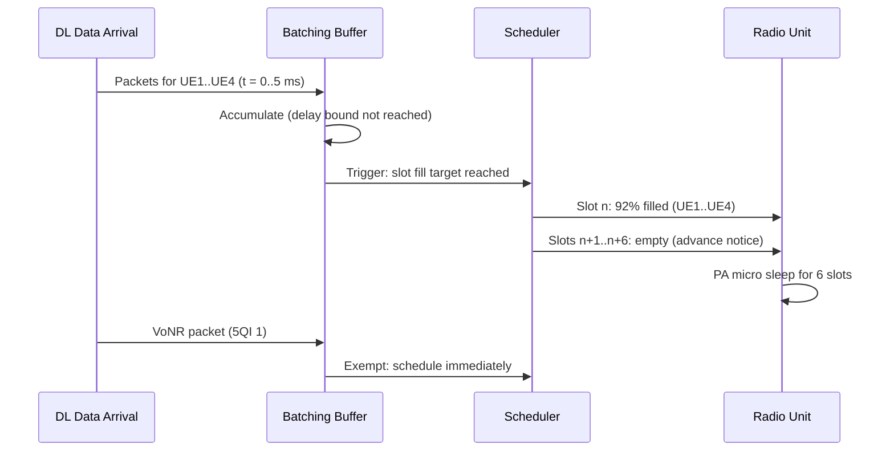

This section details the internal operational mechanisms of the Energy-Optimized Slot Allocation feature within the Energy-Optimized Slot Allocation document. It explains packet batching, trigger conditions, scheduling rules, micro-sleep signaling to the radio unit, and load-based suspension.

## Batching and Scheduling Mechanisms

Per cell, the scheduler maintains a batching horizon defined by `maxBatchDelay` milliseconds. Non-exempt downlink data arriving during this horizon is accumulated in per-UE queues instead of being scheduled immediately at the first opportunity.

### Batch Triggers

A batch trigger fires when either of the following conditions is met:
- **Delay Bound Guard:** The oldest queued packet approaches its delay bound minus a scheduling guard.
- **Slot Fill Target:** The accumulated data volume can fill a slot to at least `targetSlotFill` percent of available Physical Resource Blocks (PRBs).

Upon firing a trigger, the scheduler packs the queued data into consecutive slots at maximum fill, and then returns to packet accumulation.

### Handling Exempt Data and Retransmissions

- **Exempt Data:** Critical or delay-sensitive traffic (such as VoNR 5QI 1 packets) bypasses batching and is scheduled immediately.
- **HARQ Retransmissions:** Scheduled immediately due to carrying latency debt, but steered into already-occupied slots where possible.

### Radio Unit Signaling and Micro-Sleep

Empty slots are signaled to the radio unit one slot ahead of time, providing the required advance notice for the micro-sleep function to enter its power-down window (such as Power Amplifier micro-sleep).

## Operational Sequence

## Load Guard Suspension

The guard parameter `batchingAllowedLoad` automatically suspends packet batching when cell PRB utilization exceeds the configured threshold, removing interaction with busy-hour capacity behavior.

# Cross-References

- [Parameters](parameters.md) - Defines configuration parameters referenced during feature operation, including `maxBatchDelay`, `targetSlotFill`, and `batchingAllowedLoad`.
- [Feature Overview](feature-overview.md) - High-level summary of the Energy-Optimized Slot Allocation feature.
