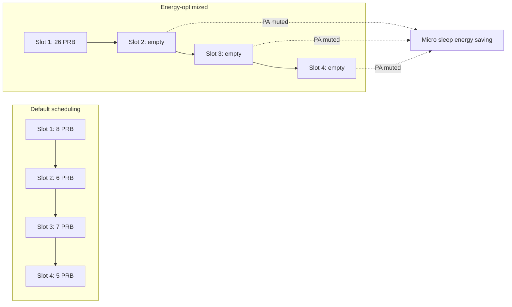

This section provides an overview of the Energy-Optimized Slot Allocation feature, detailing its core mechanism, scheduling strategy, latency bounds, and observed performance impact.

## Feature Overview

Energy-Optimized Slot Allocation reduces radio unit energy consumption at low and medium load by concentrating downlink transmissions into as few slots as possible, deliberately leaving the remaining slots empty so the radio's transmit chain can power down between transmissions. It serves as the slot-level counterpart of **Energy-Optimized Symbol Allocation** (which compacts within a slot) and acts as the enabler that maximizes the benefit of **NR Micro Sleep Tx** (which performs the actual power-down in empty transmission periods).

### Slot Packing Strategy

In a lightly loaded TDD mid-band cell, default scheduler behavior spreads pending data across slots. While this minimizes per-slot Physical Resource Block (PRB) usage and inter-cell interference, it keeps the Power Amplifiers (PA) active in almost every downlink slot—even a single scheduled PRB requires the full transmit chain, digital front end, and PA bias to be powered up.

Because PA energy consumption at low output power is dominated by fixed bias consumption rather than RF output, a slot carrying 1 PRB costs nearly as much energy as a slot carrying 100 PRBs. Energy-Optimized Slot Allocation inverts this packing strategy:

1. **Data Batching**: Batches buffered data across users subject to per-bearer latency budgets.
2. **Dense Scheduling**: Schedules data into densely filled slots.
3. **Empty Slot Creation**: Generates consecutive empty slots, allowing the radio to mute the PA via micro sleep and enter deeper transient sleep states.

### Quality of Service and Latency Constraints

The scheduler respects each bearer's 5G QoS Identifier (5QI)-derived packet delay budget:
- **Exempt Traffic**: Delay-critical traffic such as VoNR (5QI 1) and low-latency traffic (5QI 82–85) is exempt from batching.
- **Bounded Delay**: The maximum added queuing delay for other traffic types is strictly bounded by the `maxBatchDelay` parameter.

### Field Performance

In field measurements on typical suburban cells, Energy-Optimized Slot Allocation:
- Increases the empty-slot ratio at night from approximately **40% to over 85%**.
- Translates, together with NR Micro Sleep Tx, into **8–15% radio energy savings** over a 24-hour cycle.

# Cross-References

- [Feature Operation](feature-operation.md)
- [Feature Dependencies](feature-depedencies.md)
- [Parameters](parameters.md)
