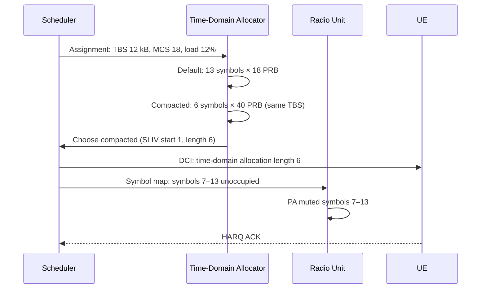

This section describes the operational mechanics of the Energy-Optimized Symbol Allocation feature, detailing how the scheduler computes compacted allocations, instructs the radio unit to mute power amplifiers, and handles HARQ retransmissions.

## Allocation and Compaction Logic

For each candidate downlink assignment when system load is below `compactionLoadThr` (see [Parameters](parameters.md)), the scheduler evaluates two candidate allocations:

1. **Default Full-Slot Allocation**: Standard allocation spanning the default symbol duration (e.g., 13 symbols).
2. **Compacted Allocation**: An allocation with the same Transport Block Size (TBS) using the maximum available PRB width and the shortest Start and Length Indicator Value (SLIV) that carries the block at the selected Modulation and Coding Scheme (MCS).

### Selection Criteria
The scheduler selects the compacted variant if:
- The compacted allocation fits within the available frequency resources.
- The estimated SINR supports the wider allocation (noting that wider allocations average over more frequency-selective fading, which is usually a wash).

## Radio Unit (RU) PA Muting

- The per-slot symbol occupation map is forwarded to the radio unit **one slot ahead**.
- The radio unit mutes the Power Amplifier (PA) starting from the last occupied symbol until the end of the slot.

## Operation Sequence

## Special Considerations

- **HARQ Retransmissions**: HARQ retransmissions reuse the original allocation shape to maintain soft-combining alignment.
- **Uplink Impact**: Uplink is unaffected; symbol compaction is exclusively a downlink transmit-energy feature.

# Cross-References

- [Parameters](parameters.md)
