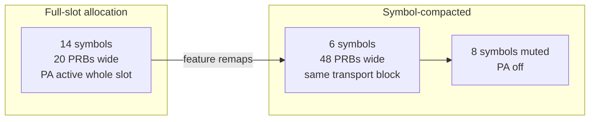

Energy-Optimized Symbol Allocation reduces radio unit energy consumption by compacting downlink transmissions within a slot into the smallest possible number of OFDM symbols, allowing the transmit chain to be muted for the remaining symbols of the slot.

## Overview and Granularity

Energy-Optimized Symbol Allocation operates at a finer granularity than Energy-Optimized Slot Allocation:
* **Energy-Optimized Slot Allocation**: Creates entirely empty slots.
* **Energy-Optimized Symbol Allocation**: Harvests energy inside slots that must carry data anyway.

## Time-Domain Resource Allocation Framework

The mechanism builds on the NR flexible time-domain resource allocation framework (TS 38.214):
* A Physical Downlink Shared Channel (PDSCH) need not span all 14 symbols of a slot.
* PDSCH mapping type B and configurable Start and Length Indicator Values (SLIV) allow allocations of 2, 4, 7, or other symbol lengths.
* **Default Configuration**: The scheduler uses full-slot (type A, symbols 1–13) allocations because they maximize the transport block size per Downlink Control Information (DCI).
* **Low Load Operation**: Pending data for a slot often fits comfortably into 4 or 7 symbols if the frequency allocation is widened.

The feature trades frequency for time by allocating more Physical Resource Blocks (PRBs) over fewer symbols, keeping the transport block size constant while shortening transmission duration.

### Power Amplifier Muting and Micro Sleep

The radio unit mutes the Power Amplifier (PA) for the unused trailing symbols of the slot via **symbol-level micro sleep**, executed by NR Micro Sleep Tx.

Because PA bias consumption is roughly proportional to active transmission time, cutting the average occupied symbols per active slot from 13 to 6 nearly halves PA energy consumption in those active slots.

## Placement Constraints and UE Transparency

* **Placement Constraints**: PDCCH, DMRS, and CSI-RS placement constraints are honored.
  * Compacted PDSCH always includes its front-loaded Demodulation Reference Signal (DMRS).
  * Symbols carrying periodic CSI-RS or Synchronization Signal Block (SSB) are excluded from muting.
* **UE Transparency**: The feature is entirely transparent to User Equipments (UEs). Time-domain allocation is signaled per assignment in the DCI, ensuring any 3GPP-compliant UE follows it.

## Energy Savings Profile

* **Typical Incremental Savings**: 3–7% of radio energy on top of slot-level mechanisms.
* **Peak Impact**: The largest contribution occurs at medium load, where full slot emptying is no longer possible.
