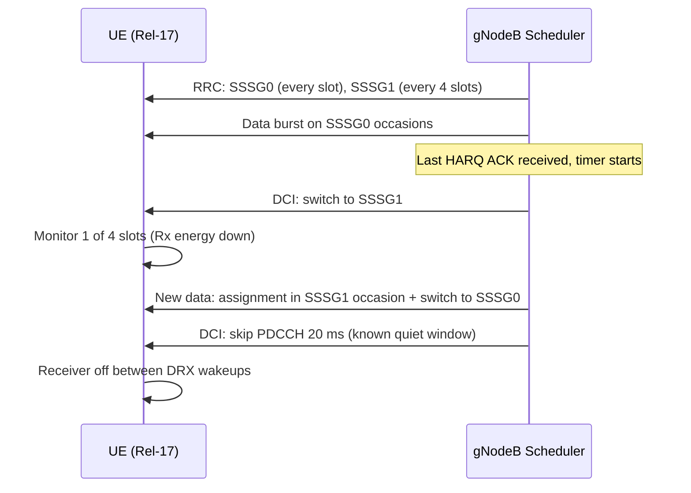

This section describes the operational mechanics of Flexible PDCCH Monitoring within the gNodeB scheduler, including Search Space Set Group (SSSG) switching, PDCCH skipping, and per-5QI monitoring profiles.

## SSSG Switching and PDCCH Skipping

At RRC connection setup or reconfiguration, capable UEs are configured with two search space set groups:
- **SSSG0**: Dense monitoring with cell default periodicity.
- **SSSG1**: Sparse monitoring every `sparsePeriod` slots.

The scheduler tracks per-UE activity:
- While data or HARQ feedback is pending, the UE is kept in SSSG0.
- When `sssgSwitchTimer` expires after the last scheduled activity, the gNodeB indicates a switch to SSSG1.
- New data arrival triggers an immediate switch back — the first assignment is sent in an SSSG1 occasion together with the group-switch indication, avoiding extra round-trip time.
- When the scheduler positively knows a quiet window (for example, after the final segment of a VoNR talk spurt with silence descriptor pacing, or after an RRC release has been decided but not yet executed), it issues a skip indication covering that window.

## Interaction Sequence

## Per-5QI Monitoring Profiles

Per-5QI policy maps each configured service class to a monitoring profile:
- **FULL**: Never sparse.
- **ADAPTIVE**: Timer-based switching.
- **AGGRESSIVE**: Switching plus skipping.

The strictest profile among a UE's active bearers wins.

# Cross-References

- [FEATURE OVERVIEW](feature-overview.md)
- [PARAMETERS](parameters.md)
