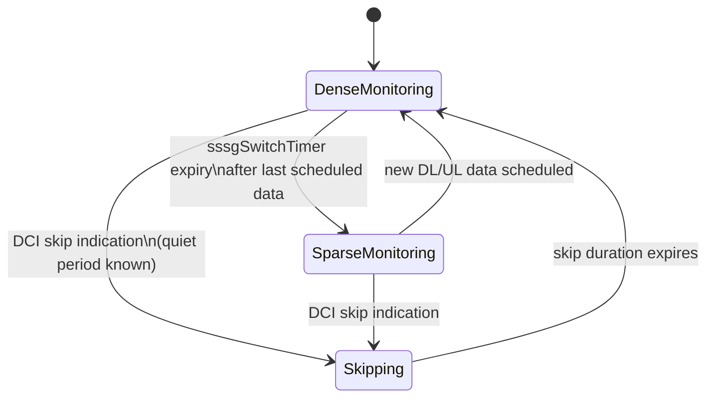

Flexible PDCCH Monitoring reduces UE energy consumption in connected mode by adapting PDCCH monitoring frequency using Search Space Set Group (SSSG) switching and PDCCH skipping mechanisms introduced in 3GPP Release 16/17 (TS 38.213, TS 38.331).

## Overview and Background

PDCCH monitoring is one of the dominant contributors to smartphone modem energy consumption. Even with no active data flow, a connected UE outside Discontinuous Reception (DRX) sleep wakes its receiver every slot (or monitoring occasion) to blind-decode PDCCH candidates. For traffic patterns with long think times—such as web browsing, messaging, and background synchronization—most blind decoding attempts yield no scheduled data.

Flexible PDCCH Monitoring provides the gNodeB with two mechanisms to reduce decoding overhead:

- **Search Space Set Group (SSSG) Switching:** The UE is configured with two monitoring profiles:
  - **Dense Group:** Used during active data transfer (e.g., monitoring every slot).
  - **Sparse Group:** Used between data bursts (e.g., monitoring every 4 or 8 slots).
  - *Switching Mechanism:* The gNodeB switches the UE between groups explicitly via DCI format 2_0 or 2_6 indication, or implicitly via a timer (`sssgSwitchTimer`) following the last scheduled transmission.
- **PDCCH Skipping:** During a known quiet period, the gNodeB orders the UE to skip PDCCH monitoring entirely for a configured duration (up to tens of milliseconds) using a single DCI indication. This mechanism provides a faster and lower-overhead alternative to C-DRX reconfiguration.

## Monitoring State Transitions

The state machine for Flexible PDCCH Monitoring governs transitions between dense monitoring, sparse monitoring, and skipping modes:

## Comparison with C-DRX and Performance Impact

Unlike Connected Mode DRX (C-DRX), which operates on cycles of tens to hundreds of milliseconds and requires Radio Resource Control (RRC) reconfiguration to modify, Flexible PDCCH Monitoring mechanisms operate at layer 1 (L1) via DCI signaling, reacting within a few slots.

Key performance characteristics include:
- **Composition with C-DRX:** Flexible PDCCH Monitoring operates within the active time of C-DRX to deliver energy savings.
- **Power Savings:** UE energy simulations based on TR 38.840 methodology and field trial results show an additional **10–20% connected-mode power reduction** for bursty traffic on top of a tuned C-DRX configuration.
- **Latency:** First-packet scheduling latency following a quiet period increases by at most the sparse monitoring period, bounded by design to a few milliseconds.

# Cross-References

- [Feature Operation](feature-operation.md)
- [Feature Dependencies](feature-depedencies.md)
- [Network Impact](network-impact.md)
- [Parameters](parameters.md)
- [Performance Management](performance-management.md)
- [Activation Procedure](activation-procedure.md)
- [Deactivation Procedure](deactivation-procedure.md)
