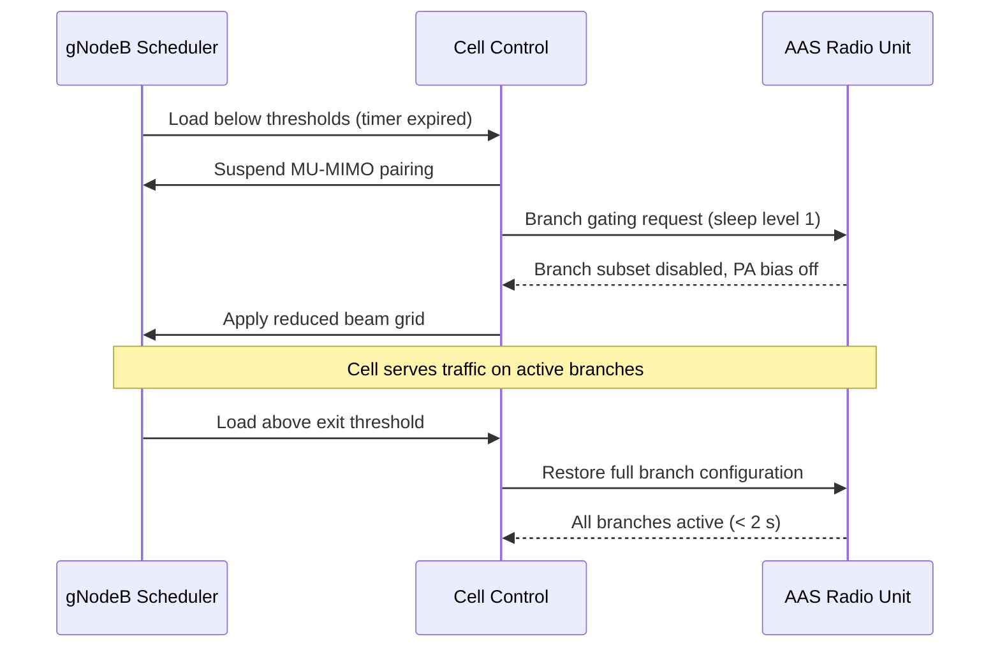

This section details the operational mechanics of the NR Massive MIMO Sleep Mode feature, including load evaluation, beam grid switching, branch gating sequences, and time-window restrictions.

## Load Evaluation and Branch Gating

The feature is controlled per NR cell. The gNodeB scheduler continuously evaluates two load measures over a sliding window:
- Average downlink PRB utilization
- Number of RRC-connected UEs

When both measures fall below `prbLoadEnterThr` and `connUsersEnterThr` for `sleepEnterTimer` seconds, the cell requests the radio to gate the configured branch subset. The SSB beam configuration is switched to a pre-computed reduced-branch grid so that coverage of the broadcast channels is preserved.

## Transition Sequence

## Time-of-Day Window

An optional time-of-day window (`sleepAllowedStart` / `sleepAllowedStop`) restricts when sleep may be entered, which is recommended for cells with volatile night-time load such as event venues.

# Cross-References

- [Feature Overview](feature-overview.md)
- [Parameters](parameters.md)
