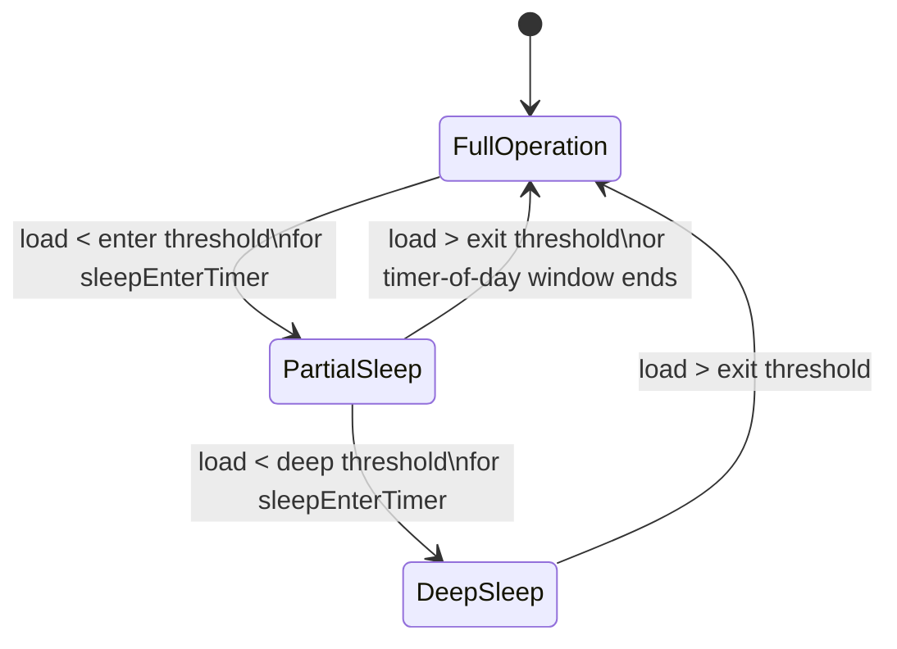

NR Massive MIMO Sleep Mode is a radio access network energy-saving feature designed to reduce power consumption in Advanced Antenna System (AAS) radios during low traffic periods. This section provides an overview of the feature's core mechanisms, supported sleep levels, state transitions, and energy savings.

## Operating Principle

A Massive MIMO radio operating on a mid-band TDD carrier typically runs 32 or 64 transceiver branches. The energy consumed by the power amplifiers is largely independent of the amount of user data carried: at 3 a.m., with a handful of connected UEs, the radio draws close to the same power as at the busy hour.

NR Massive MIMO Sleep Mode exploits this gap by switching off a configurable subset of transmit and receive branches—together with their associated power amplifiers and transceiver chains—during periods of low traffic load in the cell.

Key operational mechanisms:
- **Trigger Conditions:** When downlink PRB utilization and the number of connected users fall below configured thresholds for a sustained period, the cell autonomously transitions into a sleep level (for example, reducing from 64 active branches to 16).
- **Cell Availability:** Common channels (SSB, SIB, PRACH reception) continue to be served by the remaining active branches with an adapted beamforming configuration, ensuring the cell stays fully available for access, paging, and mobility.
- **Capacity Restoration:** When load rises above the exit threshold, the cell restores the full branch configuration within seconds.

## State Transitions

The cell transitions between full operation and sleep states based on load thresholds, enter timers, and time-of-day windows:

## Supported Sleep Depths

Two sleep depths are supported by the feature:

- **Partial Sleep:** Half of the branches are disabled. Peak MU-MIMO capacity is reduced, but SU-MIMO up to 4 layers and full beam sweeping remain available.
- **Deep Sleep:** Only a quarter of the branches remain active. The cell operates with wide static beams comparable to a conventional 4T4R sector.

## Energy Savings

Typical measured savings are **20–35%** of radio unit energy consumption during low-traffic hours, depending on the radio model and traffic profile.

# Cross-References

- [Feature Operation](feature-operation.md)
- [Parameters](parameters.md)
