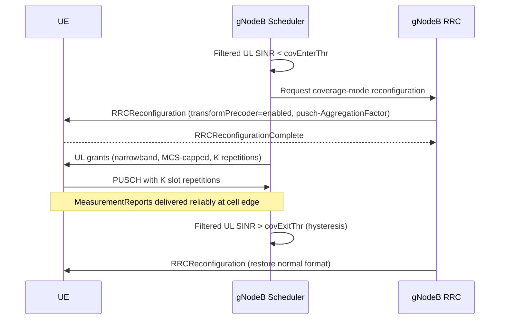

This section describes the operational mechanisms, thresholds, and state transitions of the Coverage-Optimized Uplink Transmission High-Band feature. It details how the gNodeB monitors uplink link quality and triggers coverage-optimized mode, including RRC reconfiguration, PUSCH repetition, and mobility prioritization.

## Operational Mechanism

### Uplink Quality Estimation
The gNodeB estimates the uplink link quality per active beam using Sounding Reference Signal (SRS) and Physical Uplink Shared Channel (PUSCH) Demodulation Reference Signal (DMRS) measurements, filtered over a 100 ms window.

### Coverage-Optimized Mode Entry
When the filtered Signal-to-Interference-plus-Noise Ratio (SINR) falls below the threshold `covEnterThr`, the UE enters coverage-optimized mode. The scheduler performs the following actions:
*   Switches the UE to Discrete Fourier Transform Spread Orthogonal Frequency Division Multiplexing (DFTS-OFDM) via Radio Resource Control (RRC) reconfiguration of `transformPrecoder`.
*   Restricts uplink allocations to at most `maxPrbCovMode` Physical Resource Blocks (PRBs).
*   Applies a Modulation and Coding Scheme (MCS) ceiling.

### PUSCH and PUCCH Repetition
If the SINR continues to fall below `repEnterThr`, slot-aggregated PUSCH repetition is activated. The repetition factor scales with the SINR deficit, up to `maxPuschRep`. Simultaneously, Physical Uplink Control Channel (PUCCH) resources are remapped to long formats with repetition to ensure that Hybrid Automatic Repeat Request (HARQ) feedback for measurement reports survives.

## Sequence Diagram

The following sequence diagram illustrates the transition into and out of coverage-optimized mode:

## Exit Conditions and Hysteresis

To prevent reconfiguration ping-pong, the entry and exit thresholds are asymmetric:
*   **Exit Criteria**: Exiting the coverage-optimized mode requires the filtered uplink SINR to stay above `covExitThr` for the duration specified by `covExitTimer`.
*   **Restoration**: Once the exit criteria are met, the gNodeB RRC sends an `RRCReconfiguration` message to restore the normal format.

## Mobility Prioritization

Mobility procedures are prioritized over the gradual ramp-up of resources:
*   Once a measurement report configured for A3 or A5 events is pending, the UE is immediately granted repetition resources regardless of the gradual ramp.

# Cross-References

*   [Feature Overview](feature-overview.md)
*   [Parameters](parameters.md)
