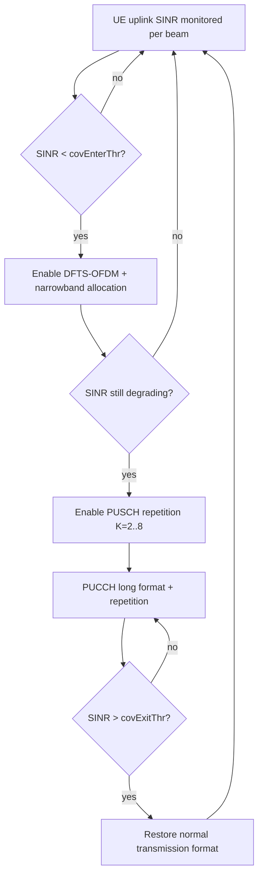

This section provides an overview of the Coverage-Optimized Uplink Transmission High-Band feature, which extends the uplink range of high-band (FR2, mmWave) NR cells to ensure reliable mobility procedures at the cell edge.

## Overview

At mmWave frequencies (typically 24–40 GHz on bands n257/n258/n260/n261), the uplink budget is constrained by the UE's modest transmit power (23 dBm power class 3, or 26 dBm power class 1 for FWA terminals) combined with high path loss and penetration loss. The downlink, benefiting from high-gain beamforming at the gNodeB, often reaches 2–4 dB further than the uplink. 

The practical consequence for mobility is severe: a UE can still decode PDCCH and PDSCH but can no longer deliver the RRC `MeasurementReport` or HARQ feedback that a handover depends on, resulting in radio link failure (RLF) instead of a clean handover.

Coverage-Optimized Uplink Transmission High-Band closes this gap with a set of coordinated uplink adaptations that engage progressively as the UE's uplink SINR degrades:

*   **Waveform Switching:** Switches from CP-OFDM to DFTS-OFDM (transform precoding per TS 38.211), reducing Peak-to-Average Power Ratio (PAPR) and allowing the UE roughly 2–3 dB higher effective transmit power before Maximum Power Reduction (MPR) back-off.
*   **PUSCH Repetition:** Employs PUSCH Repetition Type A (up to 8 slot repetitions per TS 38.214), providing up to 9 dB of combining gain for small control-plane payloads.
*   **Narrowband Allocation:** Uses a sub-PRB-conservative MCS floor and narrowband allocation to concentrate the UE's power spectral density on fewer Physical Resource Blocks (PRBs).
*   **PUCCH Format Fallback:** Falls back to long PUCCH formats (F1/F4) with increased repetition for HARQ-ACK and Scheduling Request (SR) robustness.

The net effect is an uplink coverage extension of typically 3–6 dB, translating to a 20–40% larger usable cell radius for mobility signaling in line-of-sight macro deployments, and a measurable reduction in handover-related drops at the high-band cell border.

## Adaptation Flow

The following diagram illustrates the progressive adaptation flow based on the UE's uplink SINR:

# Cross-References

*   [Feature Operation](feature-operation.md) — Detailed operational mechanisms and state transitions.
*   [Parameters](parameters.md) — Configuration parameters including threshold values like `covEnterThr` and `covExitThr`.
*   [Activation Procedure](activation-procedure.md) — Steps to enable and configure this feature in the network.
