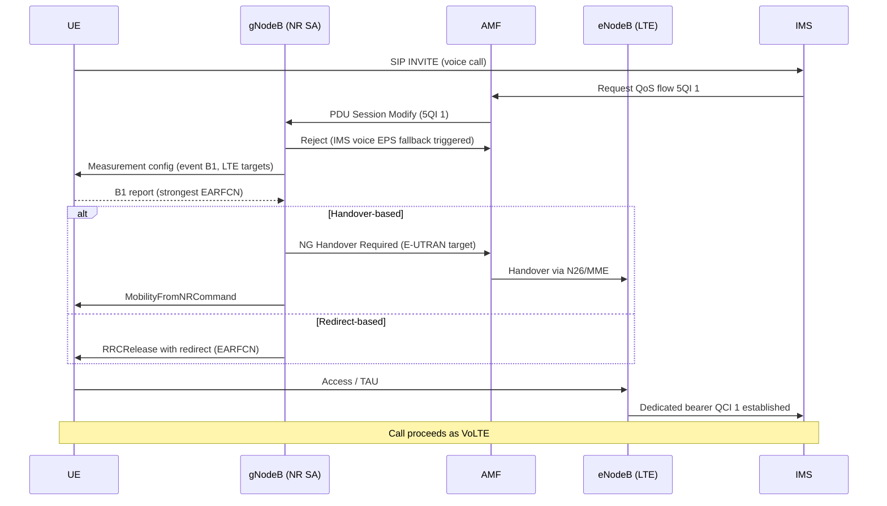

This section provides a high-level overview of the EPS Fallback for IMS Voice feature, describing its purpose, trigger mechanisms, transfer methods, and typical call-setup performance.

## Overview

EPS Fallback for IMS Voice enables voice service for UEs camped on NR Standalone (SA) in areas where Voice over NR (VoNR) is not yet available or not yet trusted. It achieves this by moving the UE to the Evolved Packet System (EPS, i.e., LTE) at voice-call establishment so that the call is set up as a normal VoLTE call. The mechanism is standardized in TS 23.502 and TS 38.331 and is the dominant voice strategy during the early and mid phases of an SA rollout.

## Trigger Mechanism

The fallback is triggered by the attempted establishment of the IMS voice bearer:
1. The AMF/SMF requests a QoS flow with 5QI 1 (conversational voice) toward the gNodeB via the NG interface.
2. If the serving cell is configured for fallback (or the gNodeB determines that VoNR cannot be sustained for this UE due to poor coverage or missing UE capability), the gNodeB rejects the 5QI 1 flow with the cause "IMS voice EPS fallback triggered" and initiates the transfer to LTE.

## Transfer Methods

Two transfer methods are supported and selectable per cell:

*   **Handover-based fallback**: An NG-based inter-RAT handover to E-UTRAN, with the voice bearer established immediately after the handover completes. This is the fastest method, with a typical added call-setup delay of 0.3–0.8 s. It requires inter-RAT handover support and N26 interface availability between the AMF and MME.
*   **Redirect-based fallback**: An `RRCRelease` with redirect information carrying the target EARFCN. This method is simpler and more robust against neighbor-data gaps, but adds typically 1–2 s of call-setup delay because the UE must reselect, read system information, and perform a fresh registration/TAU on LTE.

### Measurement-Based Target Selection

The feature includes measurement-based target selection. Before executing fallback, the gNodeB can configure a B1 inter-RAT measurement so that the UE is sent to the strongest LTE carrier rather than a blindly configured one. This significantly reduces post-fallback setup failures in multi-layer LTE networks.

### Return to NR

After call release, the return to NR is handled by normal LTE release-with-redirect or reselection priorities. This is commonly complemented by Fallback Handling at Session Setup and LTE-side fast-return features.

## Call Flow

The following sequence diagram illustrates the EPS Fallback procedure for both handover-based and redirect-based methods:

## Performance Comparison

Typical end-to-end voice call setup times vary by mechanism:

| Voice Setup Mechanism | Typical End-to-End Setup Time | Added Call-Setup Delay |
| :--- | :--- | :--- |
| **Native VoNR** | ~3.0 s | Baseline |
| **Handover-based Fallback** | 3.5–4.5 s | 0.3–0.8 s |
| **Redirect-based Fallback** | 4.5–6.0 s | 1.0–2.0 s |

# Cross-References

*   [Feature Dependencies](feature-depedencies.md) - Requirements and prerequisites for EPS Fallback.
*   [Feature Operation](feature-operation.md) - Detailed operational behavior and call flows.
*   [Network Impact](network-impact.md) - Impact on network performance and capacity.
*   [Parameters](parameters.md) - Configuration parameters for EPS Fallback.
*   [Performance Management](performance-management.md) - Counters and KPIs for monitoring fallback performance.
*   [Activation Procedure](activation-procedure.md) - Steps to enable the feature.
*   [Deactivation Procedure](deactivation-procedure.md) - Steps to disable the feature.
