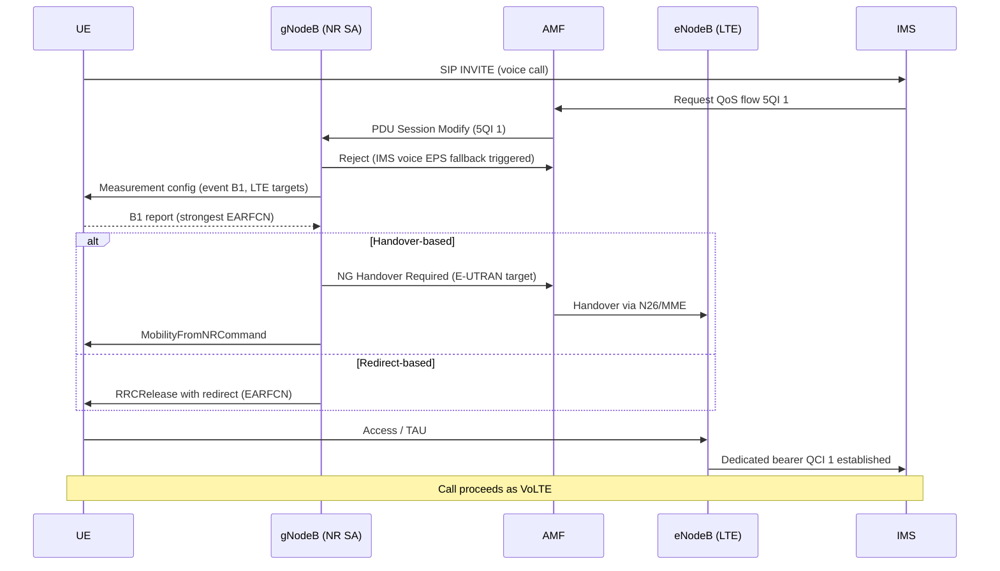

This section provides a high-level overview of the EPS Fallback for IMS Voice feature, detailing its purpose, trigger mechanisms, transfer methods, and typical performance metrics.

## Overview

**EPS Fallback for IMS Voice** is a mechanism that redirects voice calls from 5G NR Standalone (SA) to 4G LTE (VoLTE) when native Voice over NR (VoNR) is unavailable. This serves as a key transition strategy during 5G SA deployment.

### Restart Procedure

To restart the EPS Fallback feature or apply configuration updates, perform the following steps:
1. Disable the EPS Fallback feature flag or parameter on the target gNodeB cells.
2. Wait for the configuration to synchronize and active sessions to clear.
3. Re-enable the EPS Fallback feature flag to re-initialize the service.

## Trigger Mechanism

The fallback process is triggered by the attempted establishment of the IMS voice bearer:
1. The AMF/SMF requests a Quality of Service (QoS) flow with **5QI 1** (conversational voice) toward the gNodeB via the NG interface.
2. If the serving cell is configured for fallback, or if the gNodeB determines that VoNR cannot be sustained for this UE (e.g., due to poor coverage or missing UE capability), the gNodeB rejects the 5QI 1 flow with the cause **"IMS voice EPS fallback triggered"** and initiates the transfer to LTE.

## Transfer Methods

Two transfer methods are supported and can be selected on a per-cell basis:

*   **Handover-based fallback**: An NG-based inter-RAT handover to E-UTRAN, where the voice bearer is established immediately after the handover completes.
    *   *Performance*: Fastest method, with a typical added call-setup delay of **0.3–0.8 s**.
    *   *Requirements*: Requires inter-RAT handover support and N26 interface availability between the AMF and MME.
*   **Redirect-based fallback**: An `RRCRelease` message containing redirect information that carries the target EARFCN.
    *   *Performance*: Simpler and more robust against neighbor-data gaps, but adds typically **1–2 s** of call-setup delay.
    *   *Mechanism*: The UE must reselect, read system information, and perform a fresh registration/Tracking Area Update (TAU) on LTE.

### Measurement-Based Target Selection

Before executing the fallback, the gNodeB can configure a **B1 inter-RAT measurement** so that the UE is sent to the strongest LTE carrier rather than a blindly configured one. This significantly reduces post-fallback setup failures in multi-layer LTE networks.

### Post-Call Return to NR

After call release, the return to NR is handled by normal LTE release-with-redirect or reselection priorities. This is commonly complemented by Fallback Handling at Session Setup and LTE-side fast-return features.

## Call Flow

The following sequence diagram illustrates the end-to-end signaling flow for both handover-based and redirect-based EPS Fallback:

## Performance Comparison

Typical end-to-end voice call setup times vary depending on the voice strategy and fallback method:

| Voice Strategy / Method | Typical End-to-End Setup Time | Added Call-Setup Delay |
| :--- | :--- | :--- |
| **Native VoNR** | ~3.0 s | Baseline |
| **Handover-based Fallback** | 3.5–4.5 s | 0.3–0.8 s |
| **Redirect-based Fallback** | 4.5–6.0 s | 1.0–2.0 s |

# Cross-References

*   [Feature Dependencies](feature-depedencies.md) — System requirements and prerequisites for EPS Fallback.
*   [Feature Operation](feature-operation.md) — Detailed operational behavior and call flows.
*   [Network Impact](network-impact.md) — Impact on network performance and KPIs.
*   [Parameters](parameters.md) — Configuration parameters for tuning fallback behavior.
*   [Performance Management](performance-management.md) — Counters and KPIs for monitoring fallback performance.
*   [Activation Procedure](activation-procedure.md) — Steps to enable the feature in the network.
*   [Deactivation Procedure](deactivation-procedure.md) — Steps to disable the feature.
