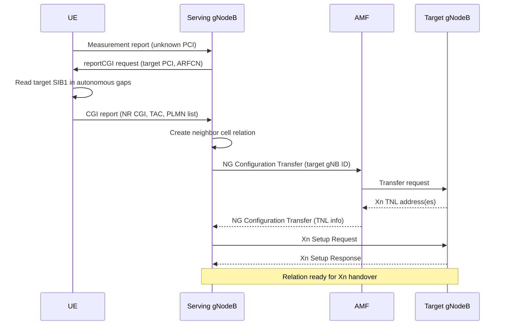

NR Automated Neighbor Relations (ANR) automatically builds and maintains the neighbor cell relation tables that every mobility procedure in the network depends on. This automation removes the need for manual neighbor planning and eliminates handover failures caused by missing or stale neighbor data.

## Functional Overview

The feature implements the 3GPP ANR function described in **TS 38.300 (Section 15.3)**. It covers:
*   NR intra-frequency relations
*   NR inter-frequency relations
*   Inter-RAT (E-UTRAN) relations

Additionally, ANR drives the automatic establishment of the Xn interfaces needed to execute handovers toward newly discovered neighbor gNodeBs.

## UE-Assisted Discovery Mechanism

The ANR mechanism is UE-assisted and operates as follows:

1.  **Measurement and Reporting**: When a connected UE measures and reports a cell whose Physical Cell Identity (PCI) is not associated with any known neighbor relation, the serving gNodeB orders the UE to decode and report the target's Cell Global Identity (CGI).
2.  **CGI Decoding**: The UE reads the target's SIB1 during autonomous gaps and reports the NR CGI (or E-UTRAN CGI for inter-RAT) using the `reportCGI` procedure defined in **TS 38.331**.
3.  **Relation Creation and Address Resolution**: Upon receiving the CGI report, the serving gNodeB:
    *   Creates the neighbor cell relation in its local database.
    *   Resolves the target's gNodeB and transport address via the core network using NG-based configuration transfer through the AMF (**TS 38.413**).
    *   Triggers Xn setup toward the target if no Xn interface exists yet.
4.  **Handover Readiness**: Once the Xn interface and relation are established, the new relation is immediately usable for measurement-based handover.

### ANR Sequence Diagram

## Table Curation and Operator Control

ANR actively curates the neighbor relation table to prevent bloat and stale entries:
*   **Removal Function**: Per-relation statistics (handover attempts, successes, and failures) feed a removal function. This function automatically deletes relations that remain unused for a configurable period and flags relations with chronic failure rates.
*   **Operator Attributes**: Operators can override automatic decisions and pin specific relations using per-relation attributes:
    *   `noHo`: The relation may not be used for handover.
    *   `noRemove`: The relation is protected from automatic deletion.
    *   `noXn`: Do not establish an Xn interface for this relation.

These attributes allow anchor relations and known-bad relations to be pinned regardless of automated observations.

## Rollout and Performance Impact

In a typical dense-urban rollout, ANR delivers significant performance improvements:
*   Discovers **95%+** of usable relations within the first **48 hours** of carrying commercial traffic.
*   Reduces handover failures attributable to missing neighbors to **near zero** (compared with several percent in manually planned networks during their first months of operation).

# Cross-References

*   [Feature Dependencies](feature-depedencies.md) — System requirements and prerequisites for ANR.
*   [Feature Operation](feature-operation.md) — Detailed operational behavior and configuration.
*   [Network Impact](network-impact.md) — Performance and capacity impacts of ANR.
*   [Parameters](parameters.md) — Configuration parameters including timers and thresholds for ANR.
*   [Performance Management](performance-management.md) — Counters and KPIs for monitoring ANR.
