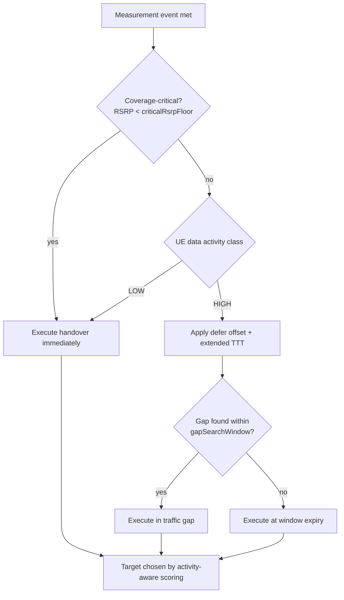

The **NR Data-Aware Mobility** feature optimizes handover decisions by making them sensitive to the User Equipment's (UE) ongoing data activity. This ensures that mobility events are timed and targeted to minimize user-plane disruption for active transfers, while still executing promptly for idle or low-activity UEs.

## Overview

Classic coverage-triggered mobility treats all UEs identically: when the A3/A5 measurement condition is met, the handover executes immediately. This occurs regardless of whether the UE is mid-way through a large download, running a latency-critical session, or exchanging only keep-alive traffic. 

Each NR handover typically interrupts the user plane for 30–60 ms (in Xn-based handovers with data forwarding). For a UE experiencing high throughput, this interruption translates into a visible throughput notch and potential TCP congestion-window collapse. For an inactive UE, however, the interruption is irrelevant.

To address this, NR Data-Aware Mobility introduces a data-activity classifier and couples it to the mobility decision in three ways:

1. **Handover timing modulation**: For UEs classified as high-activity, the feature applies an additional configurable offset and extended Time-To-Trigger (TTT) to non-critical (capacity or better-cell) handovers. This defers them briefly in the hope of finding a natural traffic gap, while never deferring coverage-critical events beyond a safety bound tied to RSRP (`criticalRsrpFloor`).
2. **Gap-seeking execution**: Once a deferrable handover is due, the scheduler monitors the transmission buffer for a gap (where RLC buffers are below `bufferGapThr` in both uplink and downlink directions) within a window defined by `gapSearchWindow`. The handover is executed inside the gap when one appears. Field data shows that 40–70% of deferred handovers find a gap within 500 ms in typical smartphone traffic.
3. **Activity-aware target scoring**: Among candidate target cells satisfying the measurement condition, targets are scored by expected post-handover throughput (based on the load and bandwidth of the target, obtained via Xn resource status reporting). Consequently, high-activity UEs prefer the target that can sustain their transfer, rather than merely the one with the strongest signal.

## Decision Flow

The following diagram illustrates the decision-making process for NR Data-Aware Mobility:

## Measurable Benefits

* **Reduced Interruption**: 20–40% fewer user-plane interruption events during active high-throughput sessions.
* **Higher Throughput**: Up to 15% higher mean throughput for cell-edge heavy users in mobility.
* **Reduced Ping-Pong**: Handover deferral naturally filters out transient A3 conditions, reducing ping-pong handovers.
* **Standards-Transparent**: The feature only shapes when and where the network triggers standard TS 38.331 procedures, requiring no special UE capabilities or support.

# Cross-References

* [Feature Operation](feature-operation.md) — Detailed operational mechanics of the data-activity classifier and gap-seeking execution.
* [Parameters](parameters.md) — Configuration parameters including `criticalRsrpFloor`, `bufferGapThr`, and `gapSearchWindow`.
* [Network Impact](network-impact.md) — Observed performance impacts and field data results.
