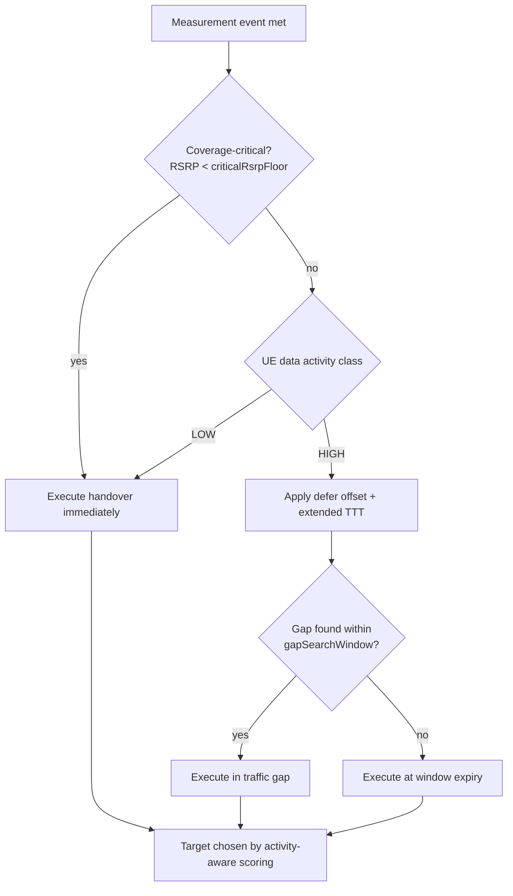

This section provides an overview of the NR Data-Aware Mobility feature, which optimizes handover decisions based on the User Equipment's (UE) ongoing data activity. It describes the core mechanisms of the feature, including handover timing modulation, gap-seeking execution, and activity-aware target scoring.

## Overview

NR Data-Aware Mobility makes handover decisions sensitive to the UE's ongoing data activity, so that mobility events are timed and targeted to minimize user-plane disruption for active transfers while still executing promptly for idle-ish UEs. 

Classic coverage-triggered mobility treats every UE identically: when the A3/A5 condition is met, the handover executes, regardless of whether the UE is mid-way through a large download, running a latency-critical session, or exchanging nothing but keep-alives. Each NR handover interrupts the user plane for typically 30–60 ms (Xn-based with data forwarding); for a UE at high throughput this translates into a visible throughput notch and potential TCP congestion-window collapse, while for an inactive UE the interruption is irrelevant.

This feature introduces a data-activity classifier and couples it to the mobility decision in three ways:

*   **Handover timing modulation:** For UEs classified as high-activity, the feature applies an additional configurable offset and extended time-to-trigger (TTT) to non-critical (capacity/better-cell) handovers, deferring them briefly in the hope of a natural traffic gap — while never deferring coverage-critical events beyond a safety bound tied to RSRP ([criticalRsrpFloor](parameters.md)).
*   **Gap-seeking execution:** Once a deferrable handover is due, the scheduler watches for a transmission gap (RLC buffers below [bufferGapThr](parameters.md) in both directions) within [gapSearchWindow](parameters.md), executing the handover inside the gap when one appears. Field data shows 40–70% of deferred handovers find a gap within 500 ms in typical smartphone traffic.
*   **Activity-aware target scoring:** Among candidate targets satisfying the measurement condition, targets are scored by expected post-handover throughput (load and bandwidth of the target, from Xn resource status reporting), so high-activity UEs prefer the target that sustains their transfer, not merely the strongest one.

## Decision Flow

The following diagram illustrates the decision-making process for NR Data-Aware Mobility:

## Measurable Benefits

*   **Reduced Interruption:** 20–40% fewer user-plane interruption events during active high-throughput sessions.
*   **Improved Throughput:** Up to 15% higher mean throughput for cell-edge heavy users in mobility.
*   **Reduced Ping-Pong:** Handover ping-pong is reduced because deferral naturally filters transient A3 conditions.

The feature is standards-transparent: it only shapes when and where the network triggers TS 38.331 procedures, requiring nothing from the UE.

# Cross-References

*   [Parameters](parameters.md) — Detailed description of parameters such as `criticalRsrpFloor`, `bufferGapThr`, and `gapSearchWindow`.
*   [Feature Operation](feature-operation.md) — Detailed operational details of the data-activity classifier and decision logic.
