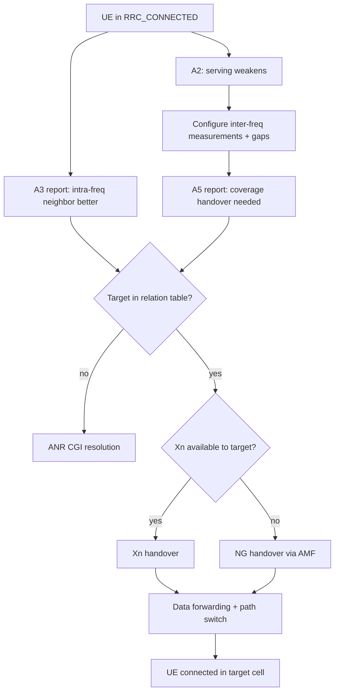
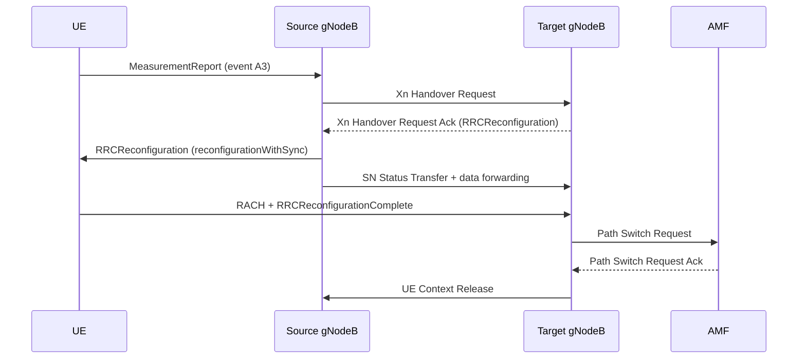

This section provides an overview of NR Mobility, the foundational connected-mode mobility feature for NR cells. It describes the complete chain from UE measurement configuration, event evaluation, and handover decision, to handover execution over Xn or NG interfaces.

## Overview

NR Mobility is the core engine for intra-frequency and inter-frequency mobility within NR. Other mobility features—such as data-aware timing, service-specific profiles, traffic offload, and automated neighbor relations—build upon the framework provided by this feature.

The feature implements the measurement and mobility framework defined in **TS 38.331** and the handover procedures defined in **TS 38.300**, **TS 38.413**, and **TS 38.423**. 

### Measurement Configuration and Reporting Events

Per neighbor-frequency relation, the gNodeB configures UEs with measurement objects and reporting events:

*   **Event A3 (Neighbor becomes offset better than SpCell):** The primary trigger for intra-frequency and equal-priority inter-frequency handovers.
*   **Event A5 (SpCell below threshold1 and neighbor above threshold2):** Coverage-triggered handover, typically used for inter-frequency moves when the serving layer coverage degrades.
*   **Events A1 / A2 (Serving above/below threshold):** Used internally to start and stop inter-frequency measurements and measurement gaps. This ensures that UEs measure other layers only when the serving cell is weakening (Event A2) and stop when it recovers (Event A1).

### Mobility Engine and Handover Execution

On receiving a qualifying measurement report, the mobility engine performs the following sequence:
1.  **Validation:** Validates the target against the neighbor relation table (populated by NR Automated Neighbor Relations).
2.  **Interface Selection:** Selects Xn handover when an Xn interface to the target exists, and NG handover otherwise.
3.  **Execution:** Executes the preparation–execution–completion sequence with lossless data forwarding for AM (Acknowledged Mode) bearers.

#### Robustness Mechanisms
The mobility engine integrates several robustness mechanisms:
*   **T304 Supervision:** Handover execution is supervised by timer T304, with re-establishment handling upon expiry.
*   **Mobility Robustness Optimization (MRO):** Handover-too-early, handover-too-late, and wrong-cell classifications feed MRO statistics.
*   **Individual Offsets:** Per-relation individual offsets are supported for surgical border tuning.

### Performance Metrics

A correctly tuned NR Mobility deployment achieves the following performance targets:
*   **Intra-frequency Handover Success Rate:** > 99.5%
*   **User-Plane Interruption:** 30–60 ms per Xn handover
*   **Handover Preparation Latency:** 
    *   10–20 ms over Xn
    *   40–80 ms over NG (highlighting the importance of maintaining Xn coverage across the neighbor graph for user experience)

### Handover Sequence (Xn Handover)

The sequence diagram below illustrates the preparation, execution, and completion phases of an Xn-based handover:

# Cross-References

*   [Feature Dependencies](feature-depedencies.md) — Details on prerequisites and co-requisites for NR Mobility.
*   [Feature Operation](feature-operation.md) — Operational details and execution flows.
*   [Network Impact](network-impact.md) — Expected impact on network performance and capacity.
*   [Parameters](parameters.md) — Configuration parameters for tuning thresholds and offsets.
*   [Performance Management](performance-management.md) — Key performance indicators (KPIs) and counters.
*   [Activation Procedure](activation-procedure.md) — Steps to enable the feature in the network.
*   [Deactivation Procedure](deactivation-procedure.md) — Steps to disable the feature.
