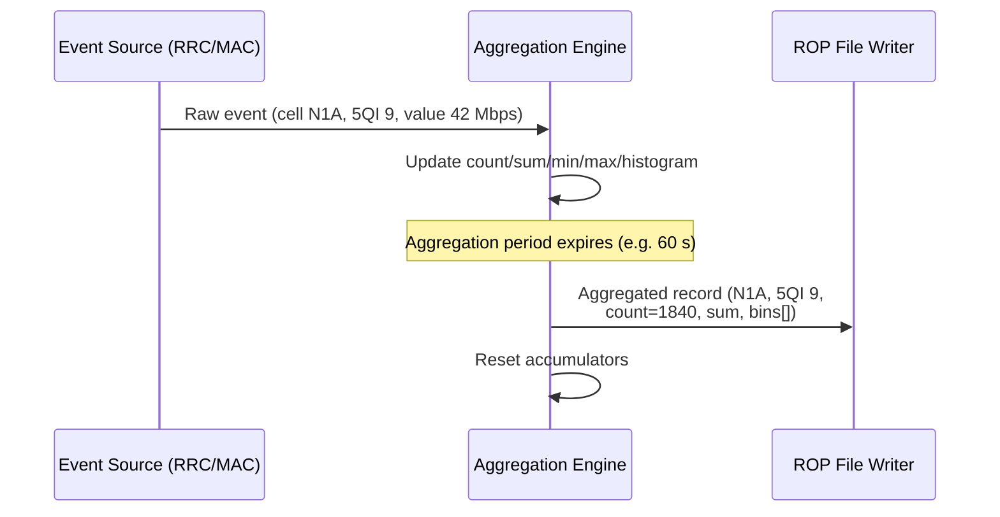

This section describes the operational mechanisms of the Aggregated PM Events feature, detailing how raw Performance Management (PM) events are routed, aggregated, and written to output files.

## Aggregation and Routing Flow

The feature is configured through aggregation groups. Each aggregation group binds a set of PM event types to an aggregation dimension and a set of statistics to compute. 

The operational sequence is as follows:
1. **Event Generation**: A raw event is generated by a source function (for example, an RRC connection setup result or a per-UE DL throughput sample).
2. **Routing and Filtering**: The PM Event Router checks whether the event type belongs to an enabled aggregation group.
3. **Accumulation**: If the event type is enabled, the event's measurement fields are folded into the group's accumulators for the matching dimension instance (for example, cell `N1A`, 5QI `9`).
4. **Record Emission**: At the end of each aggregation period, one aggregated record per active dimension instance is emitted containing the sample count, sum, minimum, maximum, and histogram bin counts.
5. **Reset**: The accumulators are reset for the next aggregation period.

## Load Shedding and Sampling

Aggregated records are timestamped with the period start time and carry a completeness flag. 

Under extreme event rates, the aggregation engine may shed load to protect system stability. If load shedding occurs:
* The completeness flag indicates that the record is based on a sampled subset.
* The applied sampling ratio is included in the record so that downstream systems can rescale the metrics accurately.

# Cross-References

* [Feature Overview](feature-overview.md) — For an overview of the Aggregated PM Events feature.
* [Parameters](parameters.md) — For configuration parameters related to aggregation groups and periods.
* [Performance Management](performance-management.md) — For details on the performance management metrics and counters.
