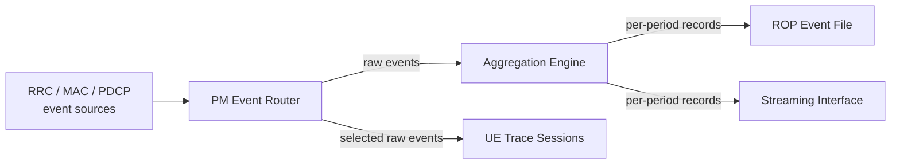

This section provides a high-level overview of the Aggregated PM Events feature, which optimizes performance management data volume in the gNodeB by consolidating high-frequency events into aggregated records.

## Overview

Aggregated PM Events reduces the volume of performance management (PM) event data produced by the gNodeB by consolidating high-frequency per-UE and per-procedure events into aggregated event records before they are written to the ROP file or handed to the streaming interface. Instead of emitting one event per RRC procedure, per HARQ report, or per throughput sample, the node accumulates the underlying measurements over a configurable aggregation period and emits a single record carrying distribution information — counts, sums, and percentile bins — for each event type and aggregation dimension (cell, 5QI, beam, or slice).

In a loaded mid-band cell, raw PM event recording can generate several gigabytes of event data per node per day. Much of this volume is consumed by downstream analytics systems that immediately re-aggregate it into per-cell or per-5QI time series. Aggregated PM Events moves that aggregation step into the gNodeB itself, typically cutting the event file volume by 80–95% while preserving the statistical content that network-level analytics need: sample counts, sums, minima, maxima, and configurable histogram bins. Full-resolution per-UE events remain available in parallel through NR UE Trace and Streaming of PM Events for the subscriber-level troubleshooting use cases that genuinely need them.

The feature operates entirely within the PM subsystem of the gNodeB and is transparent to the air interface: no UE behavior, scheduling decision, or RRC signaling is affected. It is therefore safe to enable network-wide without a maintenance window.

## Architecture and Data Flow

The following diagram illustrates how events flow from the protocol layers through the PM Event Router and Aggregation Engine to the output interfaces:

The aggregation dimensions and the histogram bin edges are configurable per event group, so an operator can, for example, keep fine-grained latency histograms for 5QI 1 voice events while heavily compressing best-effort throughput events.

# Cross-References

- [Feature Dependencies](feature-depedencies.md)
- [Feature Operation](feature-operation.md)
- [Network Impact](network-impact.md)
- [Parameters](parameters.md)
- [Performance Management](performance-management.md)
- [Activation Procedure](activation-procedure.md)
- [Deactivation Procedure](deactivation-procedure.md)
