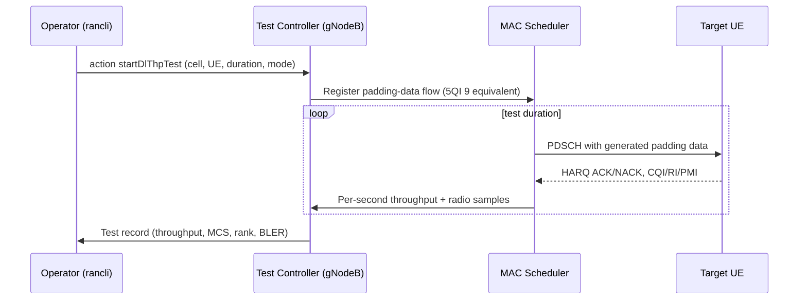

The **Downlink Throughput Test in gNodeB** feature provides an operator-triggered, node-internal downlink throughput measurement toward a selected User Equipment (UE). This document provides an overview of the feature's purpose, benefits, and high-level operational flow.

## Overview

The Downlink Throughput Test in gNodeB enables downlink throughput measurements without requiring an external application server, a drive-test team, or user cooperation. The gNodeB itself generates padding data at the Packet Data Convergence Protocol (PDCP) layer for the target UE's default bearer and schedules it exactly as ordinary user traffic. During the test window, the gNodeB measures:
* Achieved MAC and PDCP throughput
* Channel Quality Indicator (CQI) and Modulation and Coding Scheme (MCS) distribution
* Rank utilization
* Hybrid Automatic Repeat Request (HARQ) Block Error Rate (BLER)

### Key Benefits

* **Isolates the Radio Leg:** Traditional verification methods require a test UE and a speed-test application, which can be affected by factors above the Radio Access Network (RAN) such as server load, transport congestion, TCP behavior, and application performance. By generating data inside the gNodeB, this feature ensures that the measured throughput reflects only the air interface, the node's scheduling, and L1/L2 processing.
* **Definitive Bottleneck Identification:** It serves as a definitive tool to determine if the RAN is the bottleneck following capacity complaints, new site integrations, or hardware swaps.
* **Flexible Targeting:** Tests can be initiated against a specific UE (identified by its Cell Radio Network Temporary Identifier (C-RNTI) or an ongoing trace reference) or against a node-owned test UE at the site.
* **Resource Protection:** Data injection can be configured to avoid stealing resources from other users beyond a configurable Physical Resource Block (PRB) budget. Alternatively, a full-buffer mode can be used inside a maintenance window for absolute peak-rate verification.
* **Comprehensive Reporting:** Results are reported as a test record containing per-second throughput samples and the radio-quality context needed to interpret them. This allows low throughput to be immediately attributed to poor Signal-to-Interference-plus-Noise Ratio (SINR), rank limitation, or scheduler contention.

## High-Level Sequence

The following sequence diagram illustrates the interaction between the operator, the gNodeB Test Controller, the MAC Scheduler, and the target UE during a downlink throughput test:

# Cross-References

* [Feature Operation](feature-operation.md) — Detailed operational mechanisms and execution modes.
* [Parameters](parameters.md) — Configuration parameters including PRB budgets and test modes.
* [Activation Procedure](activation-procedure.md) — Steps to enable and activate the feature in the gNodeB.
