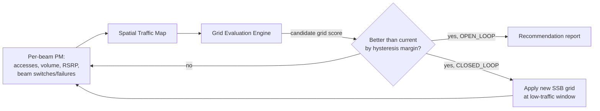

The **NR Downlink Beam Optimizer** feature continuously observes per-beam performance measurements in Massive MIMO cells and adapts the Synchronization Signal Block (SSB) beam configuration—including beam count, pointing, and coverage shape—to match the actual spatial distribution of traffic.

## Core Functionality

The feature closes the loop between beam-level observability and beam-grid configuration by performing the following operations:
*   **Data Collection:** Collects per-SSB-beam statistics, including accesses, traffic volume, RSRP distributions, beam-switch patterns, and failures.
*   **Spatial Mapping:** Builds a spatial traffic map of the cell.
*   **Grid Optimization:** Periodically proposes or autonomously applies a better-fitting beam grid from the radio's supported grid set.

Because it operates on the SSB (idle-mode and initial-access) beam layer, the feature complements and must be coordinated with features that shape the traffic beam layer or the sleep configuration.

## Problem Statement & Solution

In a default deployment, a mid-band Active Antenna System (AAS) cell transmits a standard grid of SSB beams (for example, 8 SSB beams) evenly fanned across the nominal sector. However, real-world traffic is rarely distributed evenly due to geographical and structural factors (e.g., high-rise clusters, highways, or shopping malls). 

With an even grid, some beams carry the majority of accesses at poor average RSRP while other beams remain idle. The NR Downlink Beam Optimizer addresses this mismatch:
1.  **Detection:** Detects mismatches using measurements defined in TS 38.215 (specifically SS-RSRP per beam, reported per TS 38.331 measurement configuration).
2.  **Re-weighting:** Re-weights the grid by directing narrower, higher-gain beams toward traffic hotspots and broader beams over low-traffic areas.
3.  **Constraint:** Applies a coverage-preservation constraint to ensure that no area previously covered above the cell-edge RSRP target loses SSB coverage.

## Performance Gains

Typical measured gains from deploying the NR Downlink Beam Optimizer include:
*   **1–3 dB SS-RSRP improvement** for the traffic-weighted median UE.
*   **5–15% cell-edge downlink throughput improvement** in hotspot-heavy cells.
*   **Reduction** in beam-recovery events.

## Functional Workflow

The following diagram illustrates the closed-loop and open-loop optimization workflow:

# Cross-References

*   [Feature Dependencies](feature-depedencies.md) — Coordination with traffic beam layer and sleep configuration features.
*   [Feature Operation](feature-operation.md) — Detailed operational workflow and grid evaluation.
*   [Network Impact](network-impact.md) — Observed performance gains and throughput improvements.
*   [Performance Management](performance-management.md) — Per-beam PM statistics and measurements.
