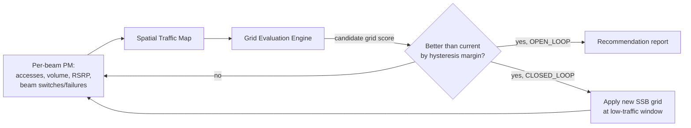

The **NR Downlink Beam Optimizer** feature continuously observes per-beam performance measurements in Massive MIMO cells and adapts the SSB beam configuration (beam count, pointing, and coverage shape) to match the actual spatial distribution of traffic. This section provides an overview of the feature's core capabilities, typical performance gains, and high-level operational flow.

## Core Capabilities

The feature closes the loop between beam-level observability and beam-grid configuration:
- **Data Collection:** It collects per-SSB-beam statistics, including accesses, traffic volume, RSRP distributions, beam-switch patterns, and failures.
- **Spatial Mapping:** It builds a spatial traffic map of the cell.
- **Grid Optimization:** It periodically proposes or autonomously applies a better-fitting beam grid from the radio's supported grid set.

In a default deployment, a mid-band AAS cell transmits a standard grid of, for example, 8 SSB beams evenly fanned across the nominal sector. Real traffic is rarely even (e.g., high-rise clusters, highways, or shopping malls). With an even grid, some beams carry most accesses at poor average RSRP while others idle. 

The optimizer detects such mismatches from measurements defined in TS 38.215 (SS-RSRP per beam, reported per TS 38.331 measurement configuration) and re-weights the grid:
- Narrower, higher-gain beams are directed toward traffic hotspots.
- Broader beams are directed over low-traffic areas.
- This is subject to a **coverage-preservation constraint** ensuring that no area previously covered above the cell-edge RSRP target loses SSB coverage.

## Typical Performance Gains

- **SS-RSRP:** 1–3 dB SS-RSRP improvement for the traffic-weighted median UE.
- **Throughput:** 5–15% cell-edge downlink throughput improvement in hotspot-heavy cells.
- **Reliability:** Reduction in beam-recovery events.

Because it works on the SSB (idle-mode and initial-access) beam layer, the feature complements—and must be coordinated with—features that shape the traffic beam layer or the sleep configuration.

## High-Level Operational Flow

The following diagram illustrates the closed-loop and open-loop optimization process:

# Cross-References

- [[Feature Operation]](feature-operation.md) — Detailed operational modes (Open Loop vs. Closed Loop) and evaluation mechanisms.
- [[Feature Dependencies]](feature-depedencies.md) — Coordination requirements with traffic beamforming and sleep configurations.
- [[Performance Management]](performance-management.md) — Specific PM counters and measurements used to build the spatial traffic map.
- [[Parameters]](parameters.md) — Configuration parameters including hysteresis margins and optimization windows.
- [[Network Impact]](network-impact.md) — Observed impacts on network KPIs and user experience.
- [[Activation Procedure]](activation-procedure.md) — Steps to enable the feature in the network.
- [[Deactivation Procedure]](deactivation-procedure.md) — Steps to disable the feature and revert to default configurations.
