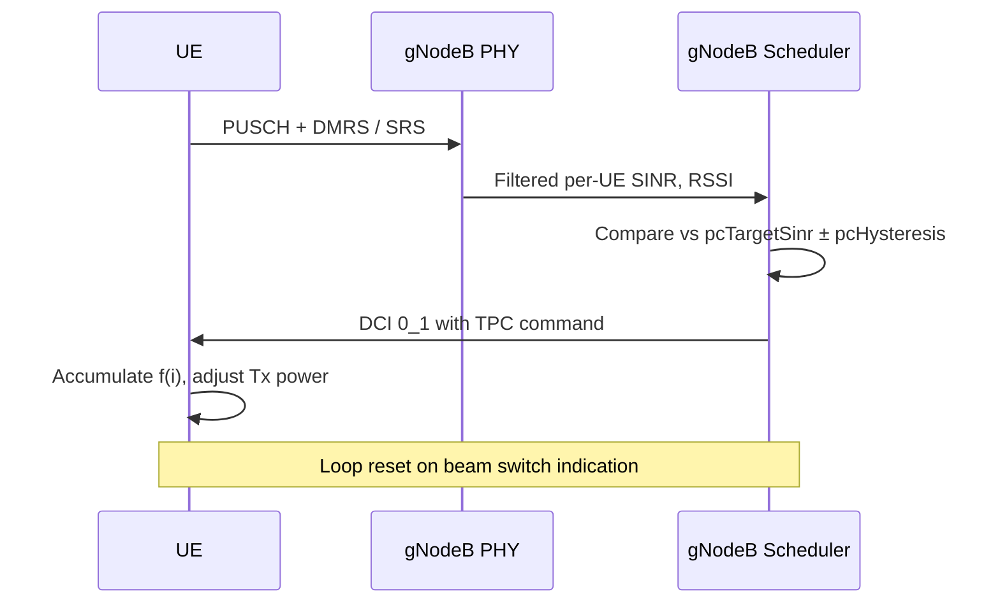

This section describes the detailed operation of the Closed-Loop Power Control High-Band feature. It covers the closed-loop state tracking, the Transmit Power Control (TPC) command generation process, and the blockage recovery mechanism designed to handle rapid signal degradation in Frequency Range 2 (FR2).

## Closed-Loop State Maintenance

For each RRC-connected User Equipment (UE) with an active FR2 serving cell, the gNodeB scheduler maintains a per-carrier closed-loop state $f(i)$ as defined in TS 38.213 clause 7.1.

## Estimation and Command Generation

During every scheduling occasion, the closed-loop control process performs the following operations:

1. **Uplink SINR Estimation**: The uplink Signal-to-Interference-plus-Noise Ratio (SINR) estimator produces a filtered per-UE SINR based on:
   - Physical Uplink Shared Channel (PUSCH) Demodulation Reference Signals (DMRS)
   - Periodic Sounding Reference Signals (SRS)
2. **Comparison against Target**: The controller compares the filtered per-UE SINR against the target parameter `pcTargetSinr` using a hysteresis window defined by `pcHysteresis` (in dB).
3. **TPC Command Issuance**:
   - If the measured SINR is outside the hysteresis window (`pcTargetSinr` $\pm$ `pcHysteresis` dB), a TPC command is embedded in the next uplink Downlink Control Information (DCI 0_1).
   - Under normal conditions, the TPC command step size is **$\pm$1 dB**.
   - If the blockage-recovery mechanism is active, a fast ramp-up step size of **+3 dB** is authorized.
4. **Command Accumulation**: Commands accumulate at the UE, which adjusts its transmission power and moves its operating point accordingly.

### Message Sequence

The following sequence diagram illustrates the feedback loop between the UE, the gNodeB Physical layer (PHY), and the gNodeB Scheduler (SCH):

*Note: The power control loop is reset upon receiving a beam switch indication.*

## Blockage Recovery Mechanism

High-band (FR2) connections are highly susceptible to sudden hand or body blockages, which can cause severe signal degradation. To mitigate this:

* **Detection**: The mechanism detects a sudden uplink SINR drop of more than `blockageDetectThr` dB.
* **Mitigation**: The scheduler temporarily authorizes larger **+3 dB** steps (instead of the standard +1 dB) until the target window is re-entered.
* **Performance Impact**: This fast ramp-up shortens recovery from hand or body blockages from seconds to a few hundred milliseconds.

# Cross-References

* [Feature Overview](feature-overview.md) — For a high-level overview of the closed-loop power control capability.
* [Parameters](parameters.md) — For detailed definitions of configuration parameters such as `pcTargetSinr`, `pcHysteresis`, and `blockageDetectThr`.
