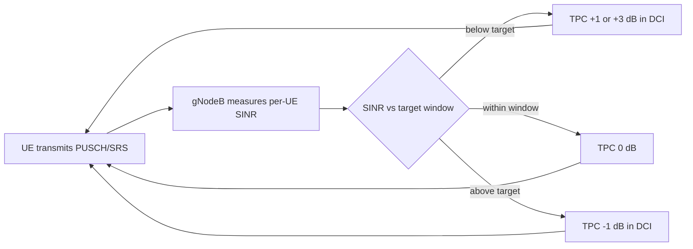

This section provides an overview of the Closed-Loop Power Control High-Band feature, which enables dynamic, network-controlled adjustments to UE uplink transmit power on FR2 mmWave carriers.

## Overview

The **Closed-Loop Power Control High-Band** feature introduces network-controlled, closed-loop adjustment of UE uplink transmit power on NR high-band (FR2, mmWave) carriers operating as Primary Cells (PCells) or Secondary Cells (SCells) in a carrier aggregation configuration. 

Without this feature, high-band uplink power is governed purely by open-loop power control. Under open-loop control:
* The UE estimates its pathloss from SSB or CSI-RS measurements.
* The UE derives its PUSCH, PUCCH, and SRS transmit power from the broadcast $P_0$ and $\alpha$ (alpha) values as specified in 3GPP TS 38.213.

### Limitations of Open-Loop Control in FR2

While open-loop control is adequate when pathloss estimates are accurate, it is inherently noisy on FR2 carriers due to several factors:
* **Abrupt Gain Changes:** Beamformed links change gain abruptly when the UE or gNodeB switches beams.
* **Blockage Events:** Blockages can cause sudden step changes of 15–25 dB in signal strength.
* **EIRP Limits:** UE power-class limitations interact unpredictably with beam-specific EIRP (Equivalent Isotropically Radiated Power) limits.

## Closed-Loop Operation

To address these limitations, this feature closes the control loop:
1. The gNodeB continuously measures the received Signal-to-Interference-plus-Noise Ratio (SINR) and the per-UE received power on PUSCH and SRS.
2. It compares these measurements against a configurable target.
3. It issues Transmit Power Control (TPC) commands in Downlink Control Information (DCI) formats `0_1`/`0_2` using either accumulated or absolute mode.

As a result, each UE converges on the minimum transmit power that satisfies the receive target.

### Closed-Loop Control Flow

## Key Benefits and Performance Gains

* **Interference Reduction:** Reduces inter-cell and inter-beam interference by ensuring UEs do not transmit with excessive power.
* **Improved Link Adaptation:** Improves uplink link adaptation accuracy.
* **Battery Savings:** Extends UE battery life by avoiding unnecessary power expenditure.
* **Mitigation of Co-scheduled Noise Floors:** In carrier aggregation deployments, uncontrolled uplink power on one carrier raises the noise floor for all co-scheduled UEs on adjacent beams. This feature prevents such noise floor degradation.
* **Typical Gains:**
  * **1.5–3 dB** reduction in average uplink Interference-over-Thermal (IoT) on loaded FR2 cells.
  * **10–20%** improvement in uplink cell-edge throughput, as cell-edge UEs no longer have to compete against over-powered cell-center UEs.

# Cross-References

* [Feature Dependencies](feature-depedencies.md) — Dependencies and hardware requirements for this feature.
* [Feature Operation](feature-operation.md) — Detailed operational behavior and algorithms.
* [Parameters](parameters.md) — Configuration parameters including SINR targets and TPC modes.
* [Activation Procedure](activation-procedure.md) — Step-by-step guidance to enable the feature in the network.
