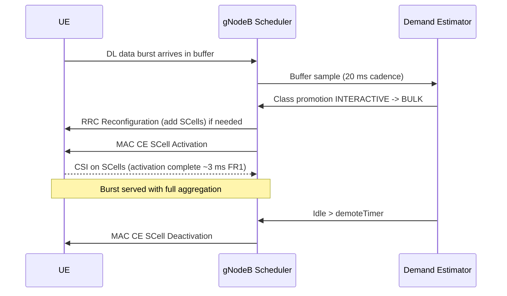

This section describes the detailed operational mechanisms of the Data-Aware Carrier Management feature, including demand estimation, class promotion, and SCell activation and deactivation procedures.

## Demand Estimation

The **Demand Estimator** in the gNodeB operates on a 20 ms sampling cadence for each UE. It monitors and maintains the following metrics:
*   An exponentially weighted average of downlink (DL) and uplink (UL) buffer occupancy.
*   The size of the last $N$ data bursts.
*   Inter-burst idle time.

## Classification and SCell Promotion

The observed metrics are mapped to demand classes using configurable thresholds and timers to manage transitions and prevent frequent state oscillations:

*   **Thresholds:** `bulkBurstThr` and `interactiveBurstThr` map observations to demand classes (e.g., INTERACTIVE, BULK).
*   **Hysteresis:** Controlled by the `classDwellTimer` to prevent ping-pong oscillation between classes.
*   **Action on Promotion to BULK:**
    1.  **RRC Reconfiguration:** If SCells are not yet configured for the UE, the scheduler issues an RRC Reconfiguration message (per TS 38.331) to add them.
    2.  **MAC CE SCell Activation:** Once configured, the scheduler issues SCell Activation MAC Control Elements (CEs) to activate all configured SCells.
    3.  **CSI Reporting:** The UE begins transmitting Channel State Information (CSI) on the activated SCells. In FR1, activation typically completes in approximately 3 ms.
    4.  **Full Aggregation:** The burst is served using full carrier aggregation across the activated cells.

## Deactivation and De-configuration (Demotion)

When a UE becomes inactive, the system systematically scales down its resources:

*   **Demotion Trigger:** Sustained inactivity beyond the `demoteTimer` duration.
*   **SCell Deactivation:** SCells are first deactivated via MAC CE SCell Deactivation.
*   **De-configuration:** If inactivity persists for a further `deconfigTimer` duration, the SCells are completely de-configured, returning the UE to a lean, energy-efficient PCell-only configuration.

## Operational Sequence

The interaction between the UE, the gNodeB Scheduler, and the Demand Estimator is illustrated in the sequence diagram below:

# Cross-References

*   [Feature Overview](feature-overview.md) — For high-level context on Data-Aware Carrier Management.
*   [Parameters](parameters.md) — For the definitions and values of `bulkBurstThr`, `interactiveBurstThr`, `classDwellTimer`, `demoteTimer`, and `deconfigTimer`.
