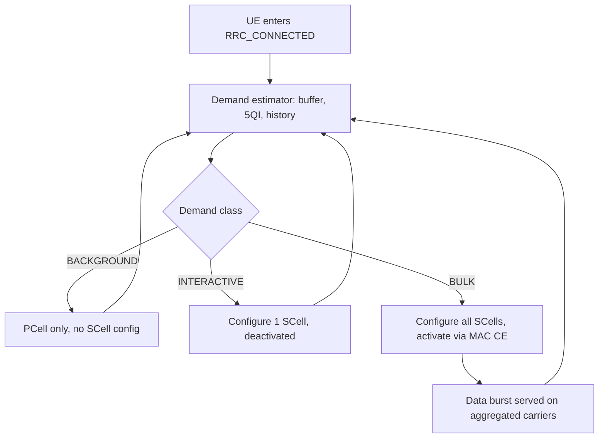

The **Data-Aware Carrier Management** feature optimizes Secondary Cell (SCell) configuration and activation decisions in New Radio (NR) carrier aggregation (CA). Instead of statically configuring SCells for all CA-capable User Equipments (UEs) during connection setup, this feature dynamically adjusts configuration based on actual and predicted data demand.

## Conventional vs. Data-Aware SCell Management

In conventional carrier aggregation implementations:
- A CA-capable UE entering `RRC_CONNECTED` state is immediately configured with the full set of candidate SCells.
- These SCells are activated based on a simple buffer threshold.
- While this maximizes peak throughput readiness, it introduces overhead and inefficiencies (such as SCell measurement configuration overhead, activation delay, increased UE battery drain, and unnecessary gNodeB Physical Downlink Control Channel (PDCCH) and RRC signaling consumption on empty carriers) for UEs with low or short-term traffic demand (e.g., keep-alive or small web transactions).

In contrast, **Data-Aware Carrier Management** introduces a per-UE demand estimator within the gNodeB to dynamically match SCell allocation to active demand.

## Per-UE Demand Estimator

The gNodeB continuously monitors several metrics to classify each UE's current traffic profile:
- Downlink and uplink buffer dynamics
- Historical burst sizes
- PDU session 5G QoS Identifier (5QI) mix
- Short-term throughput

Based on these metrics, the estimator classifies the UEs into specific demand classes:

| Demand Class | SCell Configuration & Activation Policy |
| :--- | :--- |
| **BACKGROUND** | SCells are not configured; the UE remains on the Primary Cell (PCell) only. |
| **INTERACTIVE** | A single SCell is configured but remains in a deactivated state for fast activation. |
| **BULK** | Triggers immediate configuration and activation of all applicable SCells. |

### Dynamic Re-evaluation
The UE demand classification is re-evaluated continuously. For instance, if a UE classified as BACKGROUND or INTERACTIVE begins a large data download, it is promoted to a higher class within tens of milliseconds. Activation of SCells is then executed rapidly using Medium Access Control Control Element (MAC CE)-based SCell activation as specified in TS 38.321.

## Network and UE Benefits

- **Reduced Signaling:** Network-wide SCell activations are reduced by 30% to 50%, which reduces the RRC reconfiguration signaling volume.
- **Improved Resource Efficiency:** Freed PDCCH and Channel State Information (CSI) resources on SCell carriers can be allocated to other UEs with active data demands.
- **Power Savings:** Lowers UE battery consumption due to reduced SCell measurement and monitoring requirements.
- **Negligible Impact on Performance:** User throughput impact is minimal, typically under a 2% loss at the 90th percentile.

## Operational Flow

The following diagram illustrates the continuous evaluation cycle of the Data-Aware Carrier Management feature:

# Cross-References

- [Feature Dependencies](feature-depedencies.md)
- [Feature Operation](feature-operation.md)
- [Network Impact](network-impact.md)
- [Parameters](parameters.md)
- [Performance Management](performance-management.md)
- [Activation Procedure](activation-procedure.md)
- [Deactivation Procedure](deactivation-procedure.md)
