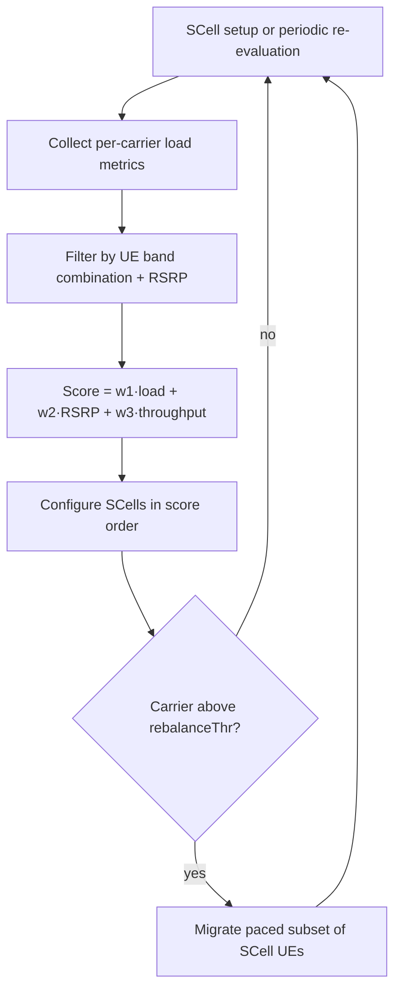

The **Dynamic Component Carrier Management** feature automates the selection, prioritization, and load-driven redistribution of component carriers across the Carrier Aggregation (CA) capable UE population of a node. 

In a statically configured network, each cell carries an operator-defined Secondary Cell (SCell) candidate list with fixed priorities, meaning every CA-capable UE is steered toward the same carriers in the same order. While effective under predictable load conditions, static priorities cannot adapt to tidal traffic patterns (e.g., when a mid-band capacity layer is congested at peak hours while a neighboring low-band carrier is under-utilized). This feature addresses this limitation by introducing dynamic, per-UE carrier assignments.

## Core Functionality

This feature replaces the static candidate list with a dynamic, per-UE carrier assignment computed at SCell setup time and re-evaluated periodically.

### Inputs and Scoring

The carrier manager collects performance and capability metrics to make assignment decisions:

*   **Per-Carrier Load Metrics:**
    *   Physical Resource Block (PRB) utilization
    *   Active UE count
    *   PDCCH utilization
    *   Average achieved throughput per scheduled UE
*   **Per-UE Inputs:**
    *   Band-combination capability
    *   Measured RSRP per candidate carrier
    *   Current demand

Using these inputs, each candidate carrier receives a composite score (calculated as `Score = w1·load + w2·RSRP + w3·throughput`), and SCells are configured in descending score order.

### Background Rebalancing

To maintain load balance over time, a background rebalancing process periodically migrates SCells of long-lived, high-volume UEs (typically Fixed Wireless Access (FWA)) away from carriers that cross a sustained-load threshold. This migration utilizes SCell release and add reconfigurations, which are paced to avoid signaling bursts.

## Observed Performance Benefits

Operators typically observe the following network improvements on multi-carrier sites during peak busy hours:
*   **10–25% higher** aggregate downlink throughput.
*   **A visible reduction** in the load spread between carriers (the standard deviation of PRB utilization across carriers is commonly halved).
*   **Fewer congestion-related scheduling delays** on the previously default-first carrier.

# Cross-References

* [Feature Dependencies](feature-depedencies.md)
* [Feature Operation](feature-operation.md)
* [Network Impact](network-impact.md)
* [Parameters](parameters.md)
* [Performance Management](performance-management.md)
* [Activation Procedure](activation-procedure.md)
* [Deactivation Procedure](deactivation-procedure.md)
