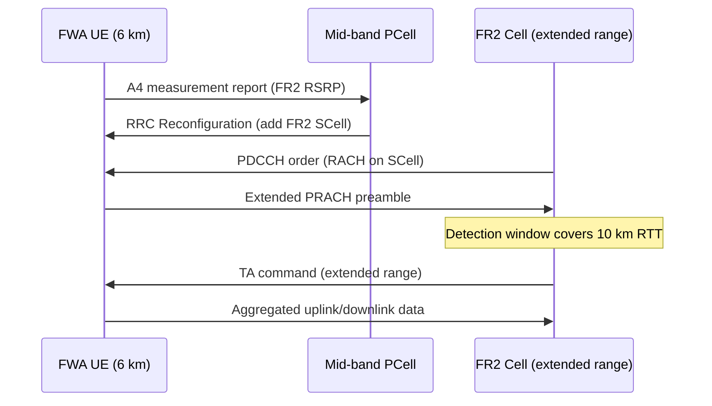

This section describes the operational mechanisms and signaling flow activated when the Extended Propagation Delay Support High-Band feature is enabled. It details the cell reconfiguration, Carrier Aggregation (CA) procedures, scheduling adjustments, and admission control policies designed to support long-range FR2 operation.

## Cell Reconfiguration & Uplink Window Expansion

When `extendedRangeMode` is enabled on an FR2 sector carrier, the cell configuration is dynamically rebuilt to accommodate the extended propagation delay:

*   **PRACH Configuration Index Update:** The PRACH configuration index is switched to an extended format. The cyclic prefix and guard time of this format are designed to cover the configured `maxCellRange`.
*   **System Information:** System Information Block 1 (SIB1) is updated accordingly to broadcast the new PRACH parameters.
*   **Baseband Window Widening:** The baseband widens both its PRACH detection window and Physical Uplink Shared Channel (PUSCH) receive window.
*   **Timing Advance Limits:** The Medium Access Control (MAC) layer raises its maximum Timing Advance (TA) command limits to match the extended range requirements.

## Carrier Aggregation & SCell Addition

For Carrier Aggregation (CA) scenarios involving a mid-band Primary Cell (PCell) and an extended-range FR2 Secondary Cell (SCell), the sequence of initial uplink timing acquisition on the SCell is executed as follows:

1.  **Measurement Report:** The FWA UE sends an A4 measurement report (FR2 RSRP) to the mid-band PCell.
2.  **RRC Reconfiguration:** The PCell triggers SCell addition and sends an RRC Reconfiguration message to the UE to add the FR2 SCell.
3.  **PDCCH Order:** The SCell issues a PDCCH-ordered Random Access Channel (RACH) procedure to the UE.
4.  **Extended PRACH Preamble:** The UE transmits an extended PRACH preamble to the SCell.
5.  **Detection and TA Command:** The SCell's baseband detection window (covering up to 10 km Round Trip Time) processes the preamble and transmits an extended range TA command to the UE.
6.  **Data Transmission:** The UE applies the TA and begins aggregated uplink/downlink data transmission.

## Scheduler Adjustments & Admission Control

To maintain network stability and performance at long distances, the system performs the following scheduling and admission operations:

*   **Timing Offsets (k2):** The scheduler compensates the UE-specific $k_2$ timing offsets. This ensures that Hybrid Automatic Repeat Request (HARQ) timing remains valid at long range despite the propagation delay.
*   **Admission Control Reject:** The admission function rejects UEs whose measured TA exceeds the configured `maxCellRange`.
*   **Observability:** UEs rejected due to range limits are released with a distinct, dedicated release cause for performance monitoring and observability.

# Cross-References

*   [Feature Overview](feature-overview.md) — For the high-level description of extended propagation delay support.
*   [Parameters](parameters.md) — For details on configuration parameters like `extendedRangeMode` and `maxCellRange`.
*   [Network Impact](network-impact.md) — For the overall network implications and capacity/performance effects.
