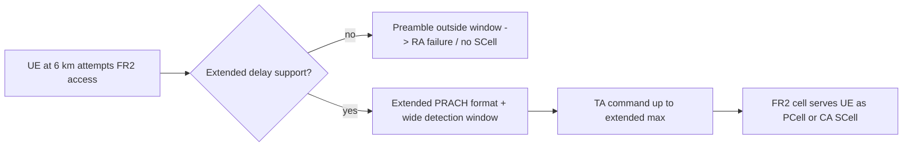

This section provides an overview of the **Extended Propagation Delay Support High-Band** feature. It explains how the feature overcomes standard physical layer limits to extend the operational range of FR2 cells for both standalone and Carrier Aggregation deployments.

## Functional Description

**Extended Propagation Delay Support High-Band** extends the maximum supported cell range of NR high-band (FR2) cells beyond the default random access and timing advance limits. This enables FR2 carriers—including those used as Secondary Cells (SCells) in carrier aggregation (CA)—to serve User Equipments (UEs) at distances where the round-trip propagation delay exceeds the design limits of standard short Physical Random Access Channel (PRACH) formats and the default timing budget.

### Default Configurations vs. Extended Range Scenarios

FR2 deployments are usually planned as short-range small cells. Default configurations reflect this assumption:
* **Short PRACH Formats:** Employs formats A1–A3 (per TS 38.211) with cyclic prefix and guard budgets designed to support roughly 1–2 km.
* **Receive Window:** Receive window dimensioning is aligned to the same 1–2 km range.

However, several deployment scenarios routinely exceed these limits:
* **Fixed Wireless Access (FWA):** High-gain Customer Premises Equipment (CPE) antennas regularly close FR2 links at 5–8 km.
* **Rural Highway Coverage:** Elevated sites covering rural highways reach similar distances (5–8 km).
* **Carrier Aggregation (CA):** CA configurations where a mid-band Primary Cell (PCell) anchors mobility can attempt to attach UEs whose FR2 SCell path is longer than the default FR2 random access design point.

Without this feature enabled, distant UEs suffer from:
* **Random Access Failures:** Preambles arrive outside the configured detection window on the FR2 cell.
* **SCell Drops:** UEs are dropped from the SCell because the required timing advance (TA) exceeds the configured maximum.

## Technical Elements Reconfigured

To support range extension up to a configurable maximum of **10 km**, the feature reconfigures three elements coherently:

1. **Extended PRACH Formats:** Enables formats B4/C2 or repeated short formats with a longer guard period.
2. **Extended Windows:** Extends the PRACH detection window and uplink receive processing window in the baseband.
3. **Elevated Timing Advance:** Raises the maximum timing advance commanded by the MAC layer (per TS 38.213 clause 4.2). For CA operation, the SCell addition procedure is modified to accept this extended TA range, allowing distant FWA UEs to aggregate FR2 capacity.

### Trade-offs and Impact

While extending the range, the feature introduces minor trade-offs:
* Slightly higher PRACH resource consumption.
* A marginal uplink capacity reduction resulting from the longer guard times.

## Process Flow

The diagram below shows how the network handles a distant UE attempting access with and without Extended Propagation Delay Support:

# Cross-References

* [Feature Dependencies](feature-depedencies.md) — Requirements and software/hardware dependencies.
* [Feature Operation](feature-operation.md) — Operational behavior and functional details of the feature.
* [Network Impact](network-impact.md) — Observed impacts on capacity, resource usage, and coverage.
* [Parameters](parameters.md) — Specific parameter settings for range extension.
* [Activation Procedure](activation-procedure.md) — Step-by-step instructions to enable the feature.
