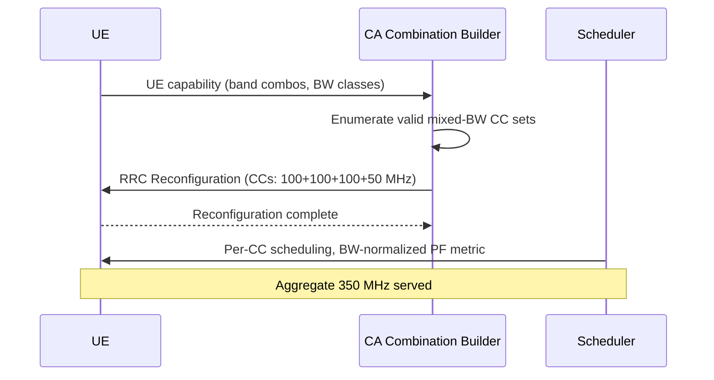

This section describes the operational mechanisms of Mixed Bandwidth Support for Carrier Aggregation (CA). It outlines how the system parses UE capabilities, constructs carrier configurations, performs scheduling, and handles carrier resizing.

## Configuration and Selection

At Carrier Aggregation (CA) configuration time, the network evaluates the capabilities of the User Equipment (UE):
- **Capability Parser:** Analyzes the UE's supported band combinations, including per-Component Carrier (CC) bandwidth classes.
- **Combination Builder:** Selects the CC set that maximizes the aggregated bandwidth within the UE's limits, permitting heterogeneous carrier sizes.

## SCell Configuration and Link Adaptation

Each configured Secondary Cell (SCell) operates with its own independent configuration and adaptation loops:
- **BWP Configuration:** Individual Bandwidth Part configuration per SCell.
- **CSI Framework:** Sized specifically to the SCell's bandwidth.
- **Link Adaptation Loop:** Sized specifically to the SCell's bandwidth.
- **Common Configurations:** Hybrid Automatic Repeat Request (HARQ), Discontinuous Reception (DRX), and measurement configurations remain common across the entire CC set.

## Scheduling and Proportional-Fair Metric

The scheduler manages resource allocation across the mixed-bandwidth CC set:
- **Normalisation:** The scheduler's Proportional-Fair (PF) metric normalizes allocations by the CC bandwidth.
- **Balanced Allocation:** This normalization ensures that carriers with smaller bandwidths (e.g., a 50 MHz CC) are neither starved nor over-weighted compared to larger carriers (e.g., 100 MHz).

## Operational Workflow

The sequence of events from capability evaluation to scheduling is illustrated below:

## Carrier Resizing and Refarming

When a carrier is resized (for example, during spectrum refarming):
- The combination builder recomputes valid CC sets.
- Affected UEs are reconfigured at their next individual reconfiguration opportunity, rather than simultaneously. This staggered approach avoids signaling storms in the network.

# Cross-References

- [Feature Overview](feature-overview.md) — For an introduction to mixed-bandwidth carrier aggregation.
- [Network Impact](network-impact.md) — For consequences on system performance and signaling.
- [Parameters](parameters.md) — For configuration details of carrier bandwidths and CA.
- [Activation Procedure](activation-procedure.md) — For steps to enable this feature on the network.
