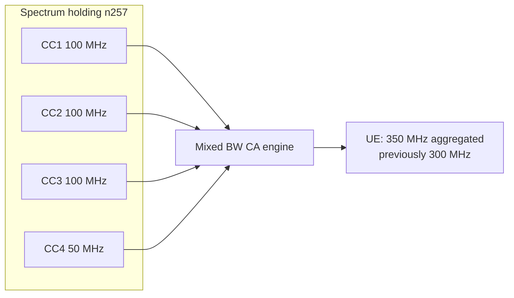

The **Mixed Bandwidth Support for Carrier Aggregation High-Band** feature removes the restriction requiring all high-band (FR2) component carriers (CCs) in an NR carrier aggregation (CA) configuration to use the same channel bandwidth. This allows operators to leverage irregular FR2 spectrum holdings and avoid leaving valuable spectrum stranded.

---

## Technical Description

In legacy configurations without this feature, the NR carrier aggregation machinery requires uniform carrier bandwidth across the FR2 CC set (typically 100 MHz per CC). This restriction forces operators with non-uniform or irregular FR2 spectrum holdings to either leave some blocks unused or forgo aggregating certain odd-sized blocks entirely. 

Irregular spectrum holdings are common in mmWave bands. Examples include:
* An operator holding a 400 MHz block in the n257 band, acquired as three 100 MHz blocks and two 50 MHz blocks ($3 \times 100 \text{ MHz} + 2 \times 50 \text{ MHz}$).
* A licensed block whose edge alignment only permits a split of 200 MHz plus 50 MHz.

With this feature enabled, the gNodeB can build CA combinations that mix **50 MHz, 100 MHz, 200 MHz, and 400 MHz** component carriers. The creation of these combinations is subject to:
* **UE capability signaling** for band-combinations per **3GPP TS 38.306**.
* **Fallback rules** defined in **3GPP TS 38.101-2**.

### Scheduling and Enforcement
* **Scheduling and Link Adaptation**: The gNodeB schedules and link-adapts each CC independently according to its individual channel bandwidth.
* **Aggregate Limits**: All aggregate performance limits—such as maximum aggregated bandwidth per UE, total CC count, and MIMO layer configurations—are enforced against actual per-UE capabilities rather than being restricted by a uniform carrier bandwidth assumption.

---

## Value and Benefits

* **Direct Spectral Efficiency**: Previously stranded 50 MHz blocks become usable as Secondary Cell (SCell) capacity.
* **Capacity and Throughput Gains**: On a typical irregular 350 MHz holding (e.g., $3 \times 100 \text{ MHz} + 1 \times 50 \text{ MHz}$), enabling mixed bandwidth CA recovers 50 to 100 MHz of aggregable spectrum. This translates to:
  * A **15% to 40% peak throughput increase** for capable UEs.
  * A proportional gain in busy-hour network capacity.
* **Simplified Refarming**: Carriers can be resized independently over time without breaking the existing CA combination.

---

## Mixed Bandwidth CA Architecture

Below is a logical representation of an irregular 350 MHz spectrum holding in the n257 band being aggregated under this feature:

---

# Cross-References

For details on configuration, dependencies, and deployment of this feature, refer to the following sections:
* [Feature Dependencies](feature-depedencies.md) — Prerequisites and co-requisite features.
* [Feature Operation](feature-operation.md) — Operational behavior and functional mechanics.
* [Network Impact](network-impact.md) — Observed performance impact on network resources and KPIs.
* [Parameters](parameters.md) — Configuration parameters to control and tune mixed bandwidth behavior.
* [Activation Procedure](activation-procedure.md) — Steps required to enable this feature on the gNodeB.
