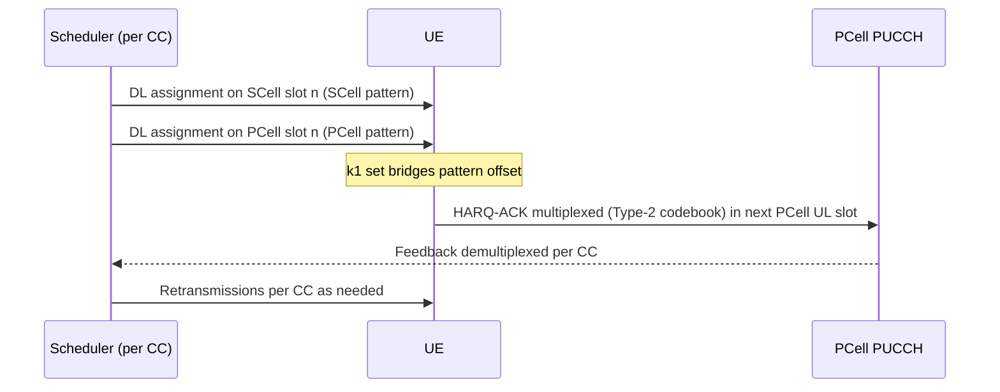

This section describes the configuration and runtime operation of the Mixed TDD Pattern Support for DL Carrier Aggregation feature. It covers carrier aggregation compatibility checks, HARQ-ACK feedback scheduling, and feedback offloading mechanisms.

## Carrier Aggregation (CA) Configuration

During Carrier Aggregation configuration, the combination builder performs compatibility checks and maps the feedback paths:
*   **Pattern Compatibility:** The system checks pattern compatibility, specifically verifying the periodicity ratio and checking for conflict slots in the case of half-duplex UEs.
*   **Per-CC $k_1$ Set Computation:** It computes a per-Component Carrier (CC) $k_1$ mapping set. This ensures that every downlink slot across all configured CCs maps to a valid Primary Cell (PCell) uplink occasion within the UE's HARQ capability window.

## Runtime Operation and Scheduling

During active operation, scheduling and feedback multiplexing proceed as follows:
*   **Independent Scheduling:** The per-CC schedulers run independently on their native TDD patterns.
*   **Dynamic HARQ-ACK Codebook:** The Type-2 (dynamic) HARQ-ACK codebook is enabled. This dynamic codebook allows feedback for a variable number of CC/slot combinations to pack efficiently into each PUCCH occasion.
*   **Capacity Reservation:** The PCell PUCCH scheduler reserves capacity based on the worst-case multiplexed codebook size to ensure feedback reliability.

### Operation Sequence

The sequence of downlink assignment, feedback bridging, and multiplexing is illustrated below:

## PUCCH Feedback Offloading

If the PUCCH load on the PCell approaches saturation, the feature can offload feedback to reduce the signaling load on the PCell:
*   **Secondary PUCCH Group:** Feedback can be offloaded to a same-pattern SCell PUCCH group.
*   **Configuration Parameter:** This is enabled by setting `pucchGroupMode` to `DUAL`.
*   **Impact:** Offloading to a dual PUCCH group halves the PCell PUCCH signaling burden.

# Cross-References

* [Feature Overview](feature-overview.md)
* [Parameters](parameters.md)
