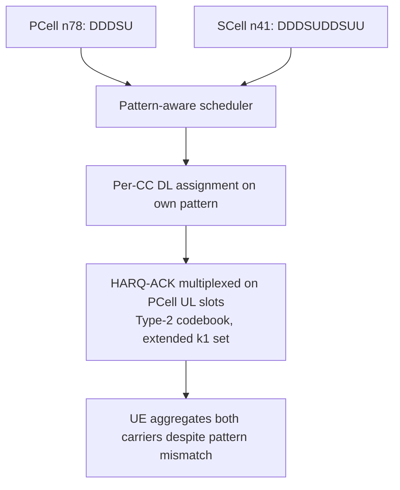

The **Mixed TDD Pattern Support for DL Carrier Aggregation** feature enables downlink carrier aggregation (DL CA) between New Radio (NR) Time Division Duplex (TDD) component carriers (CCs) operating with different uplink/downlink (UL/DL) slot patterns. This capability allows network operators to aggregate downlink capacity across bands with heterogeneous TDD patterns.

## Background and Limitations

Without this feature, all TDD component carriers (CCs) aggregated for a User Equipment (UE) must share an identical TDD-UL-DL configuration. This restriction arises because key radio and feedback mechanisms assume a common slot structure across all carriers:
*   Hybrid Automatic Repeat Request (HARQ) feedback timing
*   Channel State Information (CSI) reporting occasions
*   Cross-carrier scheduling

This restriction is particularly limiting and costly when an operator runs different slot patterns on different frequency bands due to coexistence or regulatory requirements:
*   **n78 Mid-Band:** Often deployed on a national coexistence pattern (e.g., `DDDSU`).
*   **n41 or Regional Band:** Often deployed on a more downlink-heavy pattern (e.g., `DDDSUDDSUU` variants) or other patterns mandated differently across national borders or synchronization areas.

## Feature Operation and Mechanisms

This feature introduces pattern-awareness into both the scheduler and the HARQ machinery per component carrier:

*   **Downlink Assignments:** Downlink assignments on each Secondary Cell (SCell) follow that specific SCell's own TDD pattern.
*   **HARQ-ACK Multiplexing:** HARQ-ACK feedback for all component carriers is multiplexed onto the Primary Cell (PCell) Physical Uplink Control Channel (PUCCH) within the uplink slots provided by the PCell pattern.
*   **Type-2 Codebook:** Feedback multiplexing utilizes the Type-2 HARQ codebook with per-CC $k_1$ sets sized to bridge the pattern differences, in accordance with TS 38.213 clause 9.
*   **CSI Measurement:** CSI reporting occasions are placed independently per CC.

By enabling this pattern-aware scheduling, the downlink capacity of a differently-patterned carrier — which would otherwise be unavailable for carrier aggregation — can be fully aggregated. This typically recovers an entire carrier's worth of CA capacity in networks with heterogeneous TDD patterns.

## Engineering Trade-offs

Integrating mismatched TDD patterns introduces a trade-off in feedback latency:
*   **Feedback Delay:** HARQ-ACK for SCell slots that do not align with a nearby PCell uplink slot must wait longer for transmission.
*   **Round Trip Time (RTT):** This delay increases the HARQ RTT on those specific SCell slots by 1 to 3 slots.
*   **Throughput Impact:** The increased RTT results in a minor reduction in the effective throughput of the mixed SCell, typically measuring 3% to 7% lower than a same-pattern SCell.

In practice, this slight throughput reduction is almost always a favorable trade-off compared to the alternative of not being able to aggregate the SCell carrier at all.

## Process Flow

## Cross-References

*   [Feature Dependencies](feature-depedencies.md) — Hardware and software requirements for implementing Mixed TDD pattern support.
*   [Feature Operation](feature-operation.md) — Detailed operational processes and scheduling behaviors.
*   [Network Impact](network-impact.md) — Observable changes in network performance, capacity, and KPIs.
*   [Parameters](parameters.md) — Configuration parameters associated with this feature.
