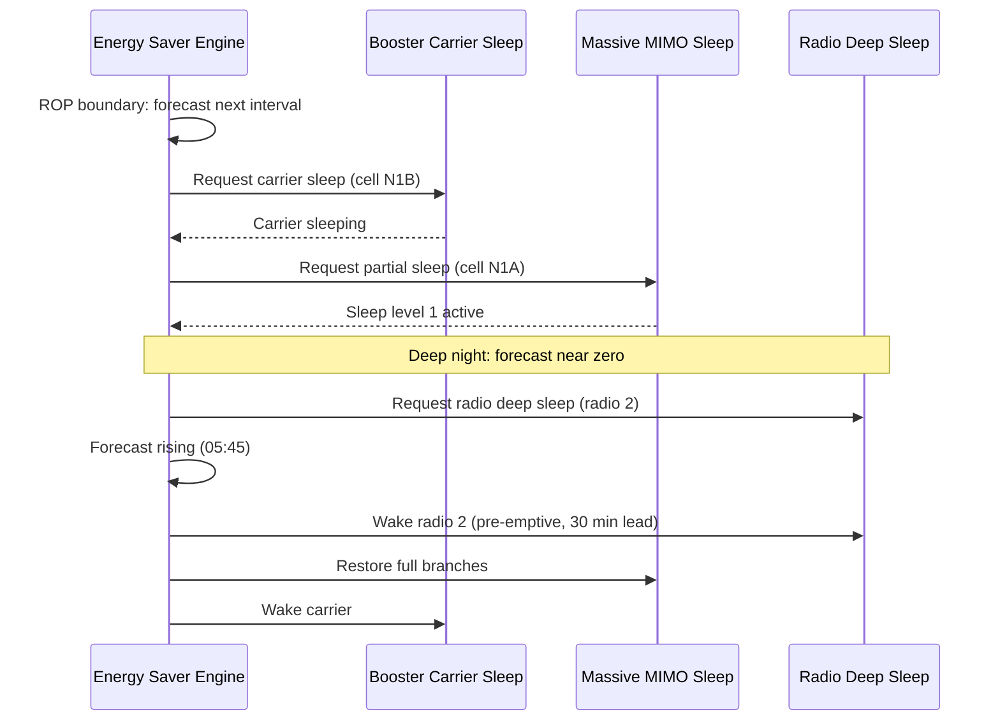

This section describes the execution cycle, load forecasting, and policy-driven control mechanisms used by the Automated Energy Saver (AES) decision engine.

## Decision Engine and Load Forecasting

The AES decision engine runs every **15 minutes**, aligned to the Report Period (ROP) boundary. For each managed cell, it produces a load forecast for the next interval. This forecast is expressed as:
- Expected physical resource block (PRB) utilization
- Expected RRC-connected users

## Policy Mapping (`savingsLevel`)

The forecast load is mapped to a target energy state based on the operator's configured `savingsLevel` policy. The policy dictates how conservatively or aggressively the entry thresholds of subordinate features are applied relative to the forecast and statistical margins:

| Policy Level | Margin Requirement |
| :--- | :--- |
| **CONSERVATIVE** | Requires the forecast **plus a 3-sigma margin** to stay below the subordinate feature's entry threshold. |
| **BALANCED** | Requires the forecast **plus a 2-sigma margin** to stay below the subordinate feature's entry threshold. |
| **AGGRESSIVE** | Requires the forecast **plus a 1-sigma margin** to stay below the subordinate feature's entry threshold. |

## Subordinate Feature Control Order

The decision engine coordinates state requests to subordinate features in a fixed, hierarchical sequence:

### Sleep (Capacity Reduction) Order
1. **Booster Carrier Sleep** (first)
2. **Massive MIMO Branch Sleep** (second)
3. **Radio Deep Sleep** (last)

### Wake-up (Capacity Restoration) Order
To ensure capacity is restored bottom-up before it is actually needed, the wake-up execution occurs in the exact **reverse order**:
1. **Radio Deep Sleep** (first)
2. **Massive MIMO Branch Sleep** (second)
3. **Booster Carrier Sleep** (last)

## Pre-emptive Wake-up

Wake-ups are issued pre-emptively based on a configurable lead time parameter, `wakeupLeadTime` (see [Parameters](parameters.md)). This pre-emptive lead time is applied ahead of the forecasted load rise. It is designed to remove the reactive wake-up latency of the subordinate features from the user experience, ensuring a seamless experience during the morning load ramp.

## Operational Sequence

The following sequence diagram illustrates the decision engine's control flow, transitioning from forecasting and enabling sleep states through to a pre-emptive wake-up sequence as the forecast load rises:

# Cross-References

- [Feature Overview](feature-overview.md) - For a high-level description of the Automated Energy Saver.
- [Feature Dependencies](feature-depedencies.md) - For details on the relationships between AES and other sleep features.
- [Parameters](parameters.md) - For details on the configuration parameters like `savingsLevel` and `wakeupLeadTime`.
