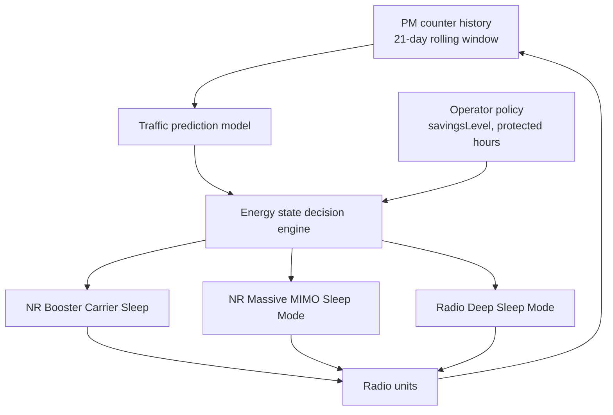

This section provides an overview of the Automated Energy Saver feature, which serves as a node-level orchestration layer to coordinate and automate individual energy-saving features within the gNodeB.

## Functional Description

Automated Energy Saver provides a node-level orchestration layer for individual energy-saving functions available in the gNodeB. Rather than requiring the operator to hand-tune thresholds and time windows for each energy feature on each cell, this feature continuously builds a per-cell traffic prediction model. It uses this model to arm, tune, and sequence the underlying savers so that the deepest safe saving level is applied at every point of the day without operator intervention.

The supported underlying savers include:
*   NR Booster Carrier Sleep
*   NR Massive MIMO Sleep Mode
*   Radio Deep Sleep Mode
*   NR Micro Sleep Tx

### The Coordination Problem

Each individual energy feature is locally safe, but their thresholds interact:
*   A booster carrier that sleeps too early pushes its load onto the coverage carrier, which then never falls below its own sleep-entry threshold.
*   A Massive MIMO cell that enters partial sleep changes the Physical Resource Block (PRB) utilization figures that a radio deep-sleep decision would otherwise rely on.

Automated Energy Saver resolves these interactions by owning the decision hierarchy. It learns each cell's diurnal load pattern from PM counter history (a rolling 21-day window with weekday/weekend separation), forecasts the load for the next decision interval, and computes a target energy state per cell and per radio. The individual features then execute the state transitions through their normal mechanisms, ensuring that all of their built-in protective behaviors (such as emergency-call blocking and wake-up guarantees) remain in force.

### Architectural Flow

## Operator Policy Control

The operator retains policy control through a small set of parameters:
*   **Overall savings ambition level** (`savingsLevel`)
*   **Protected hours**: A list of hours during which no automated action is taken
*   **Per-cell opt-out**

In field deployments, this automated coordination typically yields 5–15% additional site energy savings compared with statically configured individual features, primarily because sleep windows are extended into shoulder hours that static time-of-day settings leave untouched.

# Cross-References

*   [Feature Operation](feature-operation.md) - For more details on the decision engine and operations.
*   [Feature Dependencies](feature-depedencies.md) - For details on dependencies with underlying energy-saving features.
*   [Parameters](parameters.md) - For details on operator policy parameters like `savingsLevel`.
