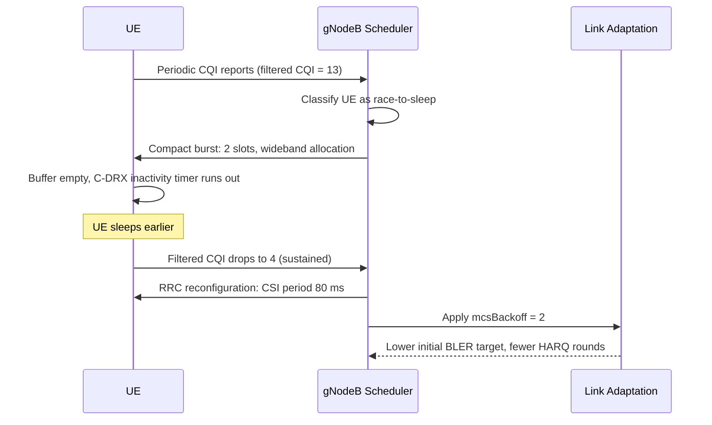

This section describes the operational logic and classification mechanisms of the **CQI-Based UE Energy Efficiency Enhancement** feature. It details how the gNodeB monitors and filters the Channel Quality Indicator (CQI) reports per connected UE to classify them into specific power-saving modes (Race-to-Sleep or Relaxed class), and explains the role of key parameters and hysteresis in class transitions.

## UE Classification & CQI Filtering

The feature maintains a smoothed wideband Channel Quality Indicator (CQI) estimate for each connected UE. This is achieved using an exponential filter over the reported CQI values, governed by the time constant `cqiFilterTime`.

Based on the filtered CQI, UEs are classified into one of two power-saving operating classes:
*   **Race-to-Sleep Class**: For UEs with good channel conditions.
*   **Relaxed Class**: For UEs with poor channel conditions.

---

## Race-to-Sleep Class

UEs whose filtered CQI is at or above the threshold `highCqiThr` are placed in the **race-to-sleep** class. The scheduling and transmission behavior for this class is optimized as follows:

*   **Downlink Aggregation**: The gNodeB scheduler aggregates pending downlink data into the smallest possible number of slots allowed by buffer size and Physical Resource Block (PRB) availability.
*   **Wideband Allocation**: The scheduler prioritizes wideband allocations to maximize throughput.
*   **Fast Inactivity Release**: Once the transmission buffer is empty, the gNodeB immediately releases the UE toward Connected-Mode DRX (C-DRX) inactivity to maximize sleeping time.

---

## Relaxed Class

UEs whose filtered CQI remains at or below the threshold `lowCqiThr` for a duration exceeding `lowCqiHoldTimer` seconds are placed in the **relaxed** class. The behavior for this class is designed to reduce RRC signaling and transmission robustness:

*   **CSI Period Reconfiguration**: The periodic Channel State Information (CSI) report interval is reconfigured from the cell default to `relaxedCsiPeriod` (increasing the interval to reduce uplink transmission overhead).
*   **Link Adaptation Back-off**: Downlink link adaptation applies a fixed back-off of `mcsBackoff` Modulation and Coding Scheme (MCS) indices. This conservative MCS assignment lowers the initial Block Error Rate (BLER) target, reducing the Hybrid Automatic Repeat Request (HARQ) retransmission probability roughly in half and conserving UE decoding/retransmission energy.

---

## Class Transitions and Hysteresis

To prevent UEs near the classification boundaries from oscillating between configurations (which would incur substantial RRC signaling overhead and counteract any UE energy savings), class transitions incorporate a hysteresis mechanism governed by `cqiClassHysteresis`.

---

## Operation Sequence

The following sequence diagram illustrates the feature operation, covering both the transition into the "Race-to-Sleep" class and the transition into the "Relaxed" class:

# Cross-References

*   [Feature Overview](feature-overview.md)
*   [Parameters](parameters.md)
