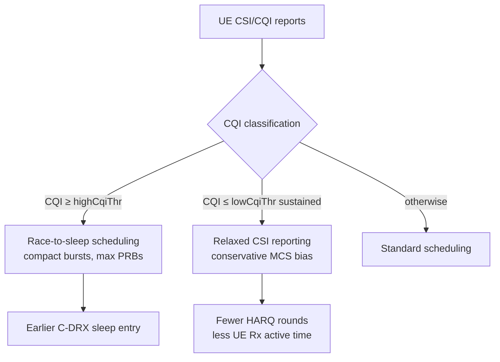

The **CQI-Based UE Energy Efficiency Enhancement** feature reduces the battery consumption of connected-mode User Equipments (UEs) by adapting scheduling and link-adaptation behavior to the radio conditions reported by each UE via its Channel Quality Indicator (CQI). 

The feature leverages the fact that a UE's modem energy consumption per delivered bit varies strongly based on channel quality. A UE experiencing high CQI can drain its buffer in a few slots and return to Connected Mode DRX (C-DRX) sleep quickly. Conversely, a UE in poor channel conditions (low CQI) must remain awake for many more slots, receiving low-rate transmissions and undergoing multiple HARQ retransmissions for the same payload size.

---

### Key Mechanisms

The CQI-Based UE Energy Efficiency Enhancement feature implements two primary strategies to optimize power consumption:

1. **CQI-Conditioned Scheduling Compaction (High-CQI UEs)**
   For UEs reporting a CQI above a configurable threshold (`highCqiThr`), the scheduler prioritizes fewer, larger physical resource block (PRB) allocations. This results in a higher aggregation of pending data into single transmission bursts, minimizing the UE's active time (RF and baseband wake time). This aligns with the classic "race to sleep" strategy outlined in the 3GPP UE power saving technical report (3GPP TR 38.840).

2. **CSI/CQI Relaxation and Link-Adaptation Biasing (Low-CQI UEs)**
   For UEs persistently reporting low CQI (below `lowCqiThr`), the feature relaxes the periodic CQI reporting configuration by configuring longer reporting intervals (per TS 38.331 `CSI-ReportConfig`). Additionally, it biases the link adaptation algorithm toward a slightly more conservative Modulation and Coding Scheme (MCS), reducing the frequency of HARQ retransmissions that would otherwise keep the UE receiver active.

Both mechanisms are standard-compliant and transparent to the UE, requiring only standard Radio Resource Control (RRC) reconfiguration. No UE-vendor-specific behavior or proprietary UE extensions are assumed.

---

### Decision and Operations Flow

The scheduling and configuration flow based on the UE's reported CQI is shown in the diagram below:

---

### Impact and Performance

* **Network-Side Impact:** The network experiences modest changes. Scheduling compaction slightly increases instantaneous PRB utilization while reducing the overall number of scheduled slots per UE.
* **UE-Side Impact:** Field measurements indicate a **5% to 12% reduction** in connected-mode modem energy consumption for typical smartphone traffic mixes. The most significant energy savings are observed for bursty applications operating on cells with a healthy overall CQI distribution.

This feature is designed to complement existing power-saving features such as Connected Mode DRX (C-DRX) and NR Service-Adaptive DRX. While those features control the timing and occurrence of the sleep opportunity itself, CQI-Based UE Energy Efficiency Enhancement shortens the active awake duration required to clear a given data burst.

# Cross-References

* [Feature Dependencies](feature-depedencies.md) — Prerequisites and interactions with other network features.
* [Feature Operation](feature-operation.md) — Detailed functional behavior and algorithmic transitions.
* [Network Impact](network-impact.md) — Observed network-side KPIs and capacity implications.
* [Parameters](parameters.md) — Configurable thresholds including `highCqiThr` and `lowCqiThr`.
* [Performance Management](performance-management.md) — Counters and KPIs for observing feature benefits.
* [Activation Procedure](activation-procedure.md) — Steps to enable the feature in the RAN.
* [Deactivation Procedure](deactivation-procedure.md) — Steps to disable the feature.
