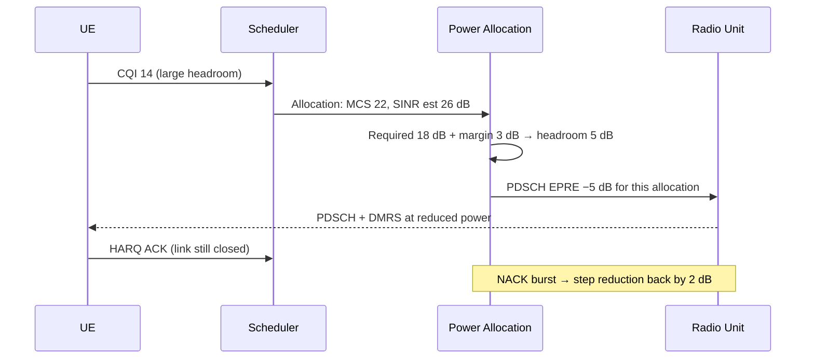

The **Feature Operation** section details the algorithmic execution of the Energy-Optimized Power Allocation feature. It outlines the step-by-step calculation performed during each scheduling occasion, the role of implicit signaling, and the built-in guard mechanism designed to maintain link robustness.

## Power Allocation Algorithm

For every scheduling occasion, the scheduler provides the candidate UE, its selected Modulation and Coding Scheme (MCS), and its filtered SINR estimate to the power allocation function. 

The function computes the available headroom as follows:

$$\text{headroom} = \text{estimated SINR} - \text{required SINR(MCS)} - \text{powerMargin}$$

* **If headroom is positive:** The Physical Downlink Shared Channel (PDSCH) Energy Per Resource Element (EPRE) for the allocation is reduced by:
  $$\text{Reduction (dB)} = \min(\lfloor\text{headroom}\rfloor, \text{maxPowerReduction})$$
  This reduction is quantized to 1 dB steps.
* **If headroom is negative or zero:** No power reduction is applied.

### Implicit Signaling

The applied power offset is signaled implicitly to the UE. Because New Radio (NR) UEs derive PDSCH demodulation from Demodulation Reference Signals (DMRS) embedded in the same physical allocation (per 3GPP TS 38.214), no additional downlink control signaling is required. The UE demodulates the transmission correctly at the reduced power.

Subsequently, the outer-loop link adaptation (OLLA) observes Hybrid Automatic Repeat Request (HARQ) feedback at this reduced power and adjusts the SINR estimate accordingly, closing the loop.

---

## Signal Flow Diagram

The following sequence diagram illustrates the message flow and calculation steps between the UE, Scheduler, Power Allocation function, and Radio Unit (RU):

---

## Radio Integration and Guard Mechanisms

### Power Amplifier (PA) Bias Optimization
The per-cell aggregate power reduction is calculated and reported to the radio hardware. Where supported by the vendor, the radio utilizes this aggregate report to optimize Power Amplifier (PA) bias dynamically, achieving hardware-level energy savings.

### Retransmission Guard Mechanism
To ensure link robustness and avoid consecutive packet drops, a guard mechanism is implemented:
* If a UE experiences **two consecutive NACKs**, all power reductions for that UE are suspended.
* The suspension remains in effect for the duration of the configured `guardTime` parameter.

# Cross-References

* [FEATURE OVERVIEW](feature-overview.md) — For the high-level context and objectives of the energy-optimized power allocation feature.
* [PARAMETERS](parameters.md) — For definitions of the control parameters used in the headroom calculation and guard mechanism (`powerMargin`, `maxPowerReduction`, and `guardTime`).
* [PERFORMANCE MANAGEMENT](performance-management.md) — For information on how these power adjustments and NACK events impact cell-level KPIs.
