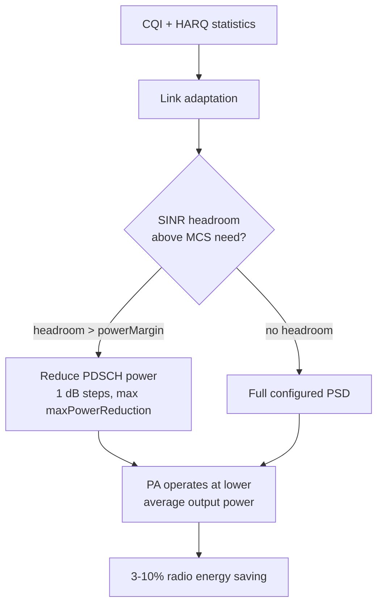

This section provides an overview of the Energy-Optimized Power Allocation feature. It explains how downlink transmit power allocated to Physical Downlink Shared Channel (PDSCH) resources is dynamically adapted to the link budget needs of scheduled User Equipments (UEs), reducing radio unit energy consumption.

## Functional Description

The Energy-Optimized Power Allocation feature reduces radio unit energy consumption by dynamically adapting the downlink transmit power allocated to PDSCH resources according to the actual link budget needs of the scheduled UEs. This is done instead of transmitting every allocation at the full configured power spectral density (PSD). 

In a conventional configuration, the cell's maximum output power is spread uniformly over the allocated Physical Resource Blocks (PRBs) regardless of where the scheduled users are located (e.g., a UE 50 meters from the site receives the same PSD as a cell-edge UE, which wastes power amplifier output and energy on links that already have substantial Signal-to-Interference-plus-Noise Ratio (SINR) margin).

### Per-Allocation Power Decisions

The feature resolves this inefficiency with a per-allocation power decision:
* **SINR Headroom Calculation**: For each scheduled UE, the link adaptation function computes the SINR headroom above what the selected Modulation and Coding Scheme (MCS) requires, derived from Channel Quality Indicator (CQI) reports and Hybrid Automatic Repeat Request (HARQ) statistics.
* **Power Reduction**: When the computed headroom exceeds a configurable margin (`powerMargin`), the PDSCH power for that allocation is reduced in steps of 1 dB, up to a maximum reduction specified by the `maxPowerReduction` parameter.
* **Power Savings**: The saved power is not redistributed to other users. Instead, it is genuinely removed from the Power Amplifier (PA) operating point, lowering DC power draw. On radios supporting fast PA bias adaptation, the average PA efficiency is further improved because the PA tracks a lower average output power.
* **Common Channels Unaffected**: Common channels—such as SSB, CSI-RS, PDCCH, and all broadcast signals—are never power-reduced. This ensures that cell coverage, mobility measurements, and initial access remain completely unaffected.

### Self-Correcting Mechanism and Performance

Because the power decision is made per UE per allocation and is re-evaluated during every scheduling occasion, the mechanism is self-correcting:
* If a power-reduced UE starts reporting lower CQI or accumulating HARQ NACKs, the reduction is stepped back immediately.
* Typical savings range between **3% and 10%** of radio unit energy in cells with a significant near-cell UE population.
* There is no measurable throughput impact when the configuration margin is left at its default value.

# Cross-References

* [Feature Operation](feature-operation.md) — Detailed operational behavior and mechanics.
* [Parameters](parameters.md) — Reference for configuration parameters including `maxPowerReduction` and `powerMargin`.
