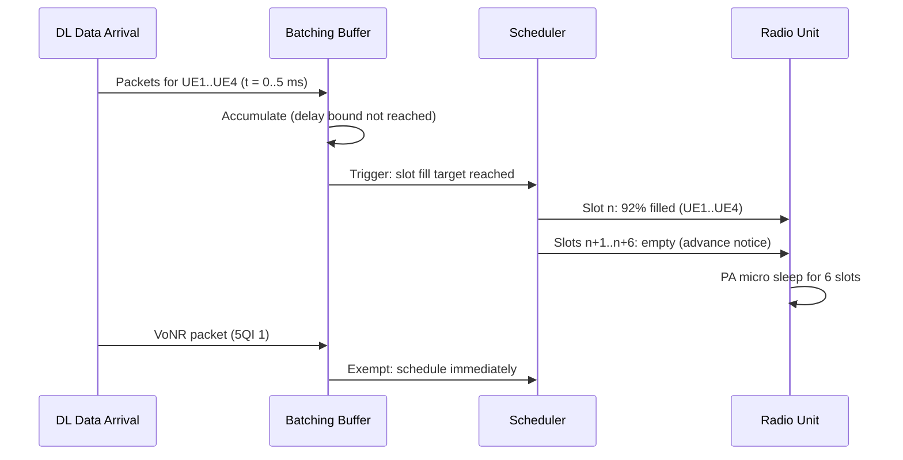

This section describes the detailed technical operation of the Energy-Optimized Slot Allocation feature, which controls how downlink data is batched, packed into active slots, and how empty slots are used to enable micro-sleep modes.

## Scheduling and Batching Mechanism

The scheduler utilizes a cell-specific batching horizon to group downlink data before transmission:

* **Batching Horizon**: A batching window of `maxBatchDelay` milliseconds is maintained per cell.
* **Accumulation**: Non-exempt downlink data arriving within this horizon is stored in per-UE queues rather than being scheduled at the first available opportunity.
* **Batch Triggers**: The accumulated data is scheduled when one of two conditions is met:
  * **Delay Bound Approach**: The oldest queued packet approaches its delay bound minus a scheduling guard.
  * **Slot Fill Target**: The total volume of accumulated data is sufficient to fill a slot to at least `targetSlotFill` percent of the available Physical Resource Blocks (PRBs).
* **Slot Packing**: Once a trigger fires, the scheduler packs the queued data into consecutive slots at maximum fill, and then resumes the accumulation process.

### Micro-Sleep Signaling

The scheduler signals empty slots to the radio unit (RU) exactly one slot ahead. This advance notice provides the RU's Power Amplifier (PA) micro-sleep function with a predictable power-down window.

### HARQ Retransmissions

* HARQ retransmissions carry their own latency debt and are scheduled immediately without being delayed by the batching horizon.
* To minimize extra slot activation, HARQ retransmissions are steered into already-occupied slots whenever possible.

### Traffic Exemption

Certain latency-sensitive traffic types bypass the batching mechanism entirely. For example, VoNR packets (5QI 1) are treated as exempt and are scheduled immediately upon arrival.

### Load-Based Suspension

To prevent degradation of cell throughput during high-traffic periods, the batching mechanism includes an automatic load guard:
* When cell PRB utilization exceeds the configured `batchingAllowedLoad` threshold, batching is suspended automatically.
* This removes any potential negative interactions with busy-hour capacity behavior.

## Operation Sequence

The sequence diagram below illustrates the arrival of downlink packets, accumulation, batch triggering based on slot fill, micro-sleep notification, and immediate scheduling of exempt VoNR traffic.

# Cross-References

* [Parameters](parameters.md) - Details the configuration parameters such as `maxBatchDelay`, `targetSlotFill`, and `batchingAllowedLoad`.
* [Feature Overview](feature-overview.md) - Provides high-level details of the Energy-Optimized Slot Allocation feature.
