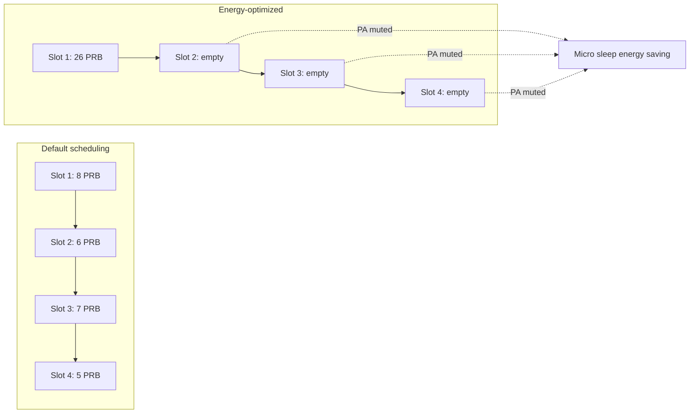

The **Energy-Optimized Slot Allocation** feature reduces radio unit energy consumption at low and medium traffic loads. It functions as the slot-level counterpart of Energy-Optimized Symbol Allocation and serves as a key enabler for maximizing the efficiency of NR Micro Sleep Tx.

## Core Mechanics

In a standard lightly loaded Time Division Duplex (TDD) mid-band cell, the scheduler's default behavior spreads pending data across slots. While this minimizes per-slot Physical Resource Block (PRB) usage and inter-cell interference, it keeps the power amplifiers (PAs) active in almost every downlink slot. Even a single scheduled PRB requires the entire transmit chain, digital front end, and PA bias to be active. Because PA energy consumption at low output power is dominated by fixed bias consumption rather than RF output, a slot carrying only one PRB consumes nearly as much energy as a slot carrying 100 PRBs.

Energy-Optimized Slot Allocation inverts this packing strategy:
1. **Batching:** It batches buffered data across multiple users.
2. **Dense Scheduling:** It schedules the batched data into densely filled slots rather than spreading it.
3. **Empty Slot Creation:** By concentrating the transmissions, it creates consecutive empty downlink slots.
4. **Power Muting:** Each empty downlink slot allows the radio to mute the PA (via micro sleep), while consecutive empty slots enable deeper transient sleep states.

## Traffic Constraints & Delay Budgets

To prevent negative user experience or service degradation, the scheduler respects each bearer's 5G Quality of Service Identifier (5QI) packet delay budget:
* **Exemptions:** Delay-critical traffic—such as Voice over NR (VoNR, 5QI 1) and low-latency services (5QI 82–85)—is entirely exempt from slot-level batching.
* **Queuing Delay Cap:** The maximum added queuing delay for non-exempt traffic is strictly bounded by the `maxBatchDelay` parameter.

## Field Measurement Performance

Field measurements demonstrate the effectiveness of this feature on typical suburban cells:
* **Empty-Slot Ratio:** Increases the empty-slot ratio at night from approximately 40% to over 85%.
* **Energy Savings:** Working in tandem with NR Micro Sleep Tx, this translates to **8% to 15% radio energy savings** over a complete 24-hour cycle.

# Cross-References

* [Feature Dependencies](feature-depedencies.md) — For the relationship with NR Micro Sleep Tx and other feature requirements.
* [Feature Operation](feature-operation.md) — For details on scheduler behavior and traffic handling.
* [Parameters](parameters.md) — For configuration details of `maxBatchDelay`.
